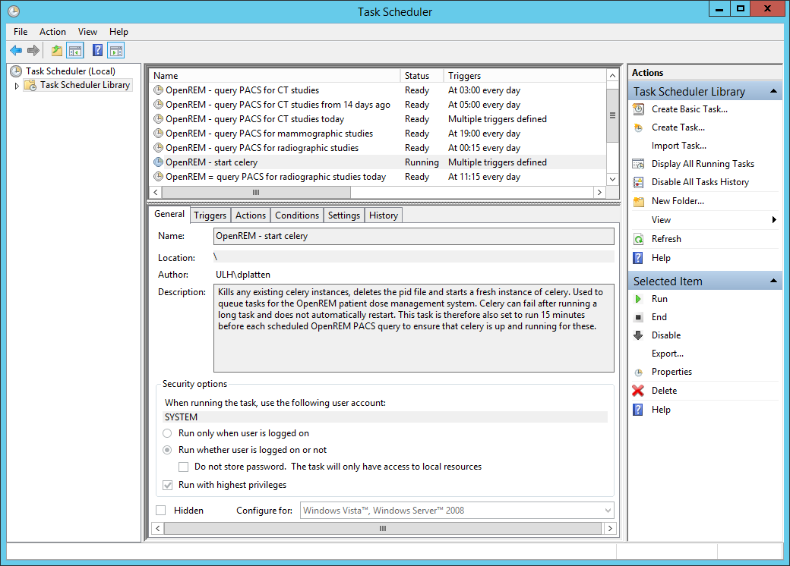
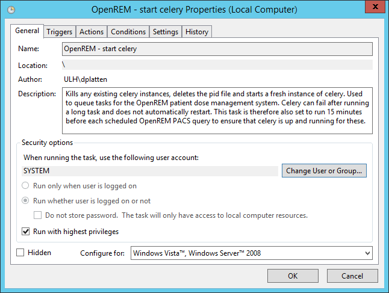
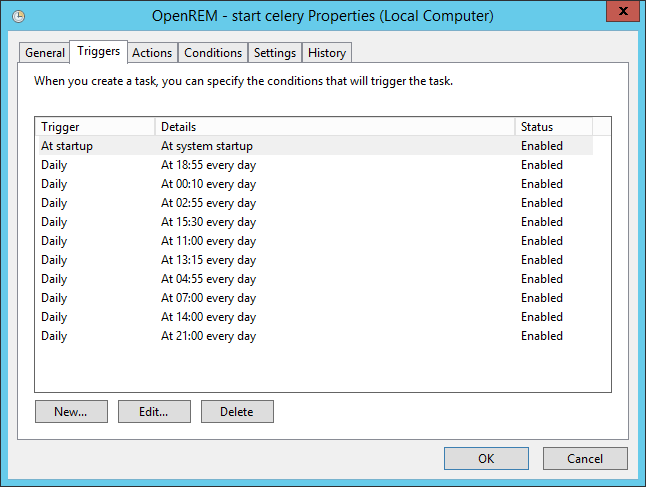
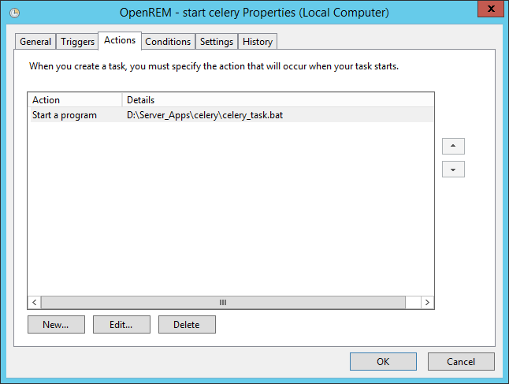
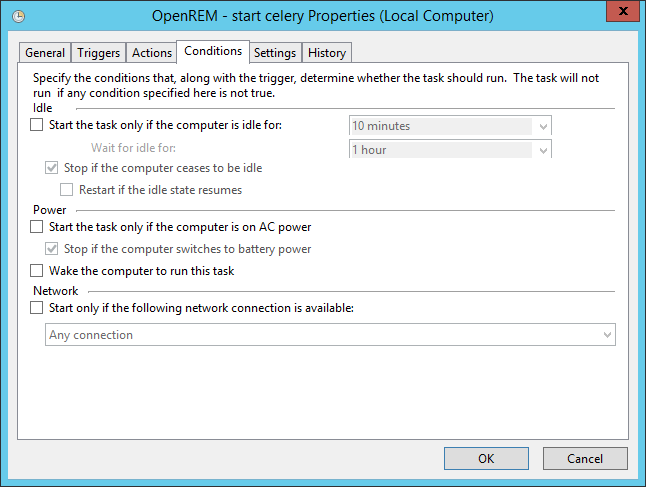
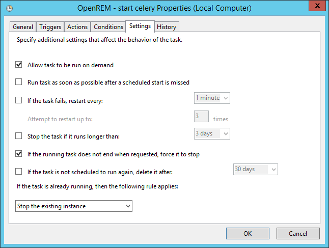

#############################
Daemonising Celery on Windows
#############################

To ensure that the Celery task queue is started at system start-up it is
advisable to launch Celery using a batch file and configure Windows Task
Scheduler to run this at system start-up.

Celery will sometimes fall over during the execution of a long task. In this
situation it will not restart on its own. Windows Task Scheduler can be used to
restart Celery on a regular basis. In addition it can be used to ensure celery
is running a few minutes prior to a scheduled PACS query.

An example batch file is shown below:

.. sourcecode:: bat
   :linenos:

    :: Change to the drive on which OpenREM is installed and navigate to the
    :: OpenREM folder
    D:
    CD D:\Server_Apps\python27\Lib\site-packages\openrem
    
    :: Attempt to shutdown celery gracefully
    celery -A openremproject control shutdown --timeout=10
    
    :: Pause this file for 10 s to ensure that the above has time to work (you may
    :: need to check that the 'timeout' command is available on your Windows
    :: system. Some systems may have 'sleep' instead, in which case replace the
    :: line below with:
    :: SLEEP 10
    TIMEOUT /T 10
    
    :: Kill any remaining celery tasks (ungraceful) and delete the pid file in case
    :: the above graceful shutdown did not work
    TASKKILL /IM /F celery.exe
    DEL /F E:\media_root\celery\default.pid
    
    :: Restart a new instance of celery 
    celery worker -n default -P solo -Ofair -A openremproject -c 4 -Q default --pidfile=e:\media_root\celery\default.pid --logfile=e:\media_root\celery\default.log

Lines 3 and 4 navigate to the OpenREM drive and folder. Line 7 attempts to
gracefully shutdown celery. Line 18 kills any celery.exe processes that are
currently running in case the graceful shutdown didn't work. Line 19 deletes
the ``default.pid`` process ID file that exists in the celery log file
location. Celery won't restart if this pid file exists. Finally, line 22 runs
a new instance of celery. If you wish to use this example you will have to
ensure that the drive letters and paths are changed to match your own OpenREM
system installation.

Setting up a scheduled task
===========================

Open ``Task Scheduler`` on the OpenREM server and then click on the ``Task Scheduler Library``
item in the left-hand pane. This should look something like figure 1 below, but without the
OpenREM tasks present.

   Figure 1: An overview of Windows Task Scheduler

To create a new task for celery click on ``Create Task...`` in the ``Actions`` menu in the
right-hand pane. Give the task a name and description. You may wish to use something similar
to the following::

    Attempts to gracefully shutdown any existing celery instances, then kills any remaining
    celery instances after 10 seconds. Deletes the celery pid file and then starts a new
    instance of celery. This is used to queue tasks for the OpenREM patient dose management
    system. Celery can fail after running a long task and does not automtically restart.
    This task is therefore also set to run 15 minutes before each scheduled OpenREM PACS
    query to ensure that celery is up and running for these.

Next, click on the ``Change User or Group`` button and type ``system`` in to the box, then
click ``Check Names``, then click ``OK``. This sets the server's ``SYSTEM`` user to run the
task. Also check the ``Run with highest prilileges`` box. Your task should now look similar
to figure 2.

   Figure 2: General properties

Next, click on the ``Triggers`` tab so that you can set when the task will be run. As a
minimum you should add an ``At startup`` trigger. To do this, click ``New...``. In the
dialogue box that appears select ``At startup`` from the ``Begin the task`` options and ensure
that the ``Enabled`` checkbox is selected. Then click ``OK``. You may wish to add other
triggers that take place at specific times during the day, as shown in figure 3.

In the example shown in figure 3 celery is started at system start up, and restarted multiple
times each day to ensure that it is running before any PACS queries. Your requirements may
be more straightforward than this example.

   Figure 3: Trigger properties

Now click on the ``Actions`` tab so that you can add the action that is taken when
the task is run. Click on ``New...``, and in the dialogue box that appears select
``Start a program`` as the ``Action``. Click on ``Browse`` and select the celery
batch file that you created earlier. Click ``OK`` to close the ``New Action``
dialogue box. Figure 4 shows an example of the the ``Actions`` tab.

   Figure 4: Action properties

There are no particular conditions set for the task, as shown in figure 5.

   Figure 5: Condition properties

Finally, click on the ``Settings`` tab (figure 6). Check the ``Allow task to be run on demand``
box, and also the ``If the running task does not end when requested, force it to stop`` box.
Choose ``Stop the existing instance`` from the ``If the task is already running, then the following rule applies:``
list. Then click the ``OK`` button to add the task to the scheduler library.

   Figure 6: Task settings
