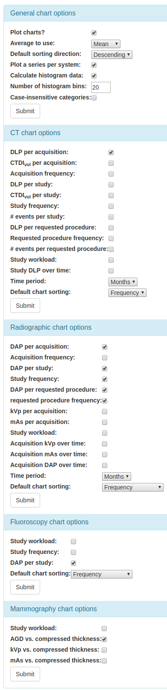

######
Charts
######

Charts of the currently filtered data can now be shown for CT and radiographic
data. The user can configure which plots are shown using the ``Chart options``
on the CT and radiographic pages.

*New in 0.7.0* Some charts can now be plotted with a series per x-ray system.
This option can be switched on or off via the ``Chart options``.

*New in 0.7.0* Chart plotting options can also be configured by choosing the
``Chart options`` item on the ``User options`` menu at the top of the OpenREM
homepage.

*New in 0.7.0* Individual charts can be displayed full-screen by clicking on
the ``Toggle fullscreen`` button that is positioned below each chart.

*New in 0.7.0* The chart plotting status is displayed on the OpenREM homepage.

*New in 0.7.0* The the number of histogram data bins can be set in ``Chart options``.

*New in 0.7.0* Histogram plots can display absolute or normalised values.

*New in 0.7.0* Colours used for plotting have been updated.

   CT chart sorting options

*New in 0.7.0* The data in many of the charts can now be sorted interactively
by the user by clicking on one of the sorting options below the individual chart:

The user can set the default sorting type and direction by choosing the 
``Chart options`` item from the ``User options`` menu on the OpenREM homepage.

The charts are automatically updated to reflect any filters that the user
applies to the data.

*************
Chart options
*************

*New in 0.7.0* Chart options can now be configured by choosing the
``Chart options`` item from the ``User options`` menu on the OpenREM homepage:

They can also be set via the CT and Radiographic summary pages:

.. image:: img/ChartCTOptions.png
   :width: 297px
   :align: center
   :height: 376px
   :alt: OpenREM CT chart options screenshot

The first option, ``Plot charts?``, determines whether any plots are shown.
This also controls whether the data for the plots is calculated by OpenREM.
Some plot data is slow to calculate when there is a large amount of data: some
users may prefer to leave ``Plot charts?`` off for performance reasons.
``Plot charts?`` can be switched on and activated with a click of the
``submit`` button after the data has been filtered.

The user can switch off all chart plotting by clicking on the
``Switch charts off`` link in the ``User options`` menu in the navigation bar
at the top of any OpenREM page. Clicking on this link takes the user back to
the home page.

A user's chart options can also be configured by an administrator via OpenREM's
user administration page.

***********
Chart types
***********

The available charts for CT data are as follows:

    * Bar chart of mean DLP for each acquisition protocol (all systems combined):

      .. image:: img/ChartCTMeanDLP.png
         :width: 925px
         :align: center
         :height: 587px
         :alt: OpenREM chart of mean DLP screenshot

      The tooltip of each bar shows the user the name of the protocol, the
      number of acquisitions of that type and also the mean DLP and/or
      CTDI\ :sub:`vol` value.

      Clicking on an individual bar takes the user to a histogram of DLP
      for that protocol. The tooltip for each histogram bar shows the
      number of acquisitions. The histogram tooltip also includes a link
      that will take the user to the list of studies that contain the
      acquisitions represented by that histogram bar:

      .. image:: img/ChartCTMeanDLPhistogram.png
         :width: 930px
         :align: center
         :height: 511px
         :alt: OpenREM histogram of acquisition DLP screenshot

    * Bar chart of mean DLP for each acquisition protocol (one series per system):

      .. image:: img/ChartCTMeanDLPperSystem.png
         :width: 930px
         :align: center
         :height: 592px
         :alt: OpenREM chart of mean DLP (one system per series) screenshot

      Ticking the `Plot a series per system` box in the ``Chart options`` will
	  result in plots with one series per x-ray system for some charts.

      Clicking on an x-axis label will take you to a plot with a histogram per
	  x-ray system:

      .. image:: img/ChartCTMeanDLPhistogramPerSystem.png
         :width: 930px
         :align: center
         :height: 515px
         :alt: OpenREM histogram of acquisition DLP (one series per system) screenshot

      Clicking on the `Toggle normalisation` button when viewing a histogram will
	  normalise all of the series. This can sometimes make it easier to compare one
	  distribution with another:

      .. image:: img/ChartCTMeanDLPhistogramPerSystemNorm.png
         :width: 926px
         :align: center
         :height: 515px
         :alt: OpenREM normalised histogram of acquisition DLP (one series per system) screenshot

    * Pie chart of the frequency of each acquisition protocol. Clicking on a
      segment of the pie chart takes the user to the list of studies that
      contain the acquisitions in that segment.

      .. image:: img/ChartCTacquisitionFreq.png
         :width: 932px
         :align: center
         :height: 510px
         :alt: OpenREM chart of acquisition frequency screenshot

    * Bar chart of mean DLP for each study name. Clicking on a bar takes the
      user to a histogram of DLP for that study name. Clicking on a histogram
      bar tooltip link takes the user to the list of studies that correspond to
      the data represented by that bar.

      .. image:: img/ChartCTMeanStudyDLP.png
         :width: 835px
         :align: center
         :height: 769px
         :alt: OpenREM chart of mean study DLP screenshot

    * Pie chart of the frequency of each study name. Clicking on a segment of
      the pie chart takes the user to the list of studies that correspond to
      the data in that segment.

    * *New in 0.7.0* Bar chart of mean DLP for each requested procedure. Clicking
      on a bar takes the user to a histogram of DLP for that procedure. Clicking
      on a histogram bar tooltip link takes the user to the list of procedures
      that correspond to the data represented by that bar.

    * *New in 0.7.0* Pie chart of the frequency of each requested procedure.
      Clicking on a segment of the pie chart takes the user to the list of
      procedures that correspond to the data in that segment.

    * Pie chart showing the number of studies carried on each day of the week:

      .. image:: img/ChartCTworkload.png
         :width: 930px
         :align: center
         :height: 540px
         :alt: OpenREM pie chart of study workload per day of the week screenshot

      Clicking on a segment of the pie chart takes the user to a pie chart
      showing the studies for that weekday broken down per hour:

      .. image:: img/ChartCTworkload24hours.png
         :width: 932px
         :align: center
         :height: 542px
         :alt: OpenREM pie chart of study workload per hour in a day screenshot

    * Line chart showing the mean DLP of each study name over time. The time
      period per data point is chosen by the user in the ``Chart options``.
      Note that selecting a short time period may result in long calculation
      times. The user can zoom in to the plot by clicking and dragging the
      mouse to select a date range. The user can also click on items in the
      chart legend to show or hide individual lines.

      .. image:: img/ChartCTMeanDLPoverTime.png
         :width: 932px
         :align: center
         :height: 542px
         :alt: OpenREM line chart of mean DLP per study type over time screenshot

    * *New in 0.7.0* The user can choose whether the data displayed on the charts
      is the mean, the median or both by using the drop-down `Average to use`
      selection.
      

The available charts for radiographic data are as follows:

    * Bar chart of mean DAP for each acquisition protocol. Clicking on a bar
      takes the user to a histogram of DAP for that protocol. Clicking on the
      tooltip link of a histogram bar takes the user to the list of studies
      that contain the acquisitions in the histogram bar.

    * Pie chart of the frequency of each acquisition protocol. Clicking on a
      segment of the pie chart takes the user to the list of studies that
      contain the acquisitions in that segment.

    * Bar chart of mean kVp for each acquisition protocol. Clicking on a bar
      takes the user to a histogram of kVp for that protocol. Clicking on the
      tooltip link of a histogram bar takes the user to the list of studies
      that contain the acquisitions in the histogram bar.

    * Bar chart of mean mAs for each acquisition protocol. Clicking on a bar
      takes the user to a histogram of mAs for that protocol. Clicking on the
      tooltip link of a histogram bar takes the user to the list of studies
      that contain the acquisitions in the histogram bar.

    * Pie chart showing the number of studies carried out per weekday. Clicking
      on a segment of the pie chart takes the user to a pie chart showing the 
      studies for that weekday broken down per hour.

    * Line chart showing how the mean DAP of each acquisition protocol varies
      over time. The time period per data point can be chosen by the user in
      the ``Chart options``. Note that selecting a short time period may result
      in long calculation times. The user can zoom in to the plot by clicking
      and dragging the mouse to select a date range. The user can also click on
      items in the legend to show or hide individual lines.

    * *New in 0.7.0* The user can choose whether the data displayed on the charts
      is the mean, the median or both by using the drop-down `Average to use`
      selection.

********************
Exporting chart data
********************

An image file of a chart can be saved using the menu in the top-right hand side
of any of the charts. The same menu can be used to save the data used to plot a
chart: the data can be downloaded in either csv or xls format.
