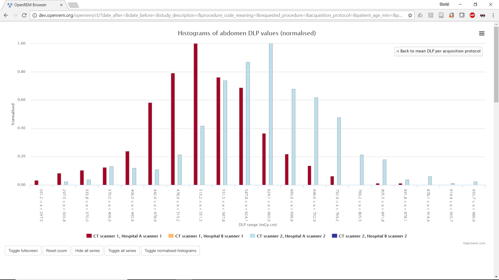

######
Charts
######

***********
Chart types
***********

============================================================
1. Bar chart of average values across a number of categories
============================================================

.. figure:: img/ChartCTMeanDLP.png
   :figwidth: 50%
   :align: right
   :alt: Bar chart of mean DLP per acquisition

   Figure 1: Bar chart of mean DLP per acquisition

For example, mean DAP per acquisition type (figure 1). Below each bar chart
there are options to sort the order of the data. This can be by average value,
size of data sample, or alphabetically.

Clicking on an entry in the bar chart legend toggles the display of the
corresponding series on the chart.

.. figure:: img/ChartCTMeanDLPhistogram.png
   :figwidth: 50%
   :align: right
   :alt: Histogram of acquisition DLP

   Figure 2: Histogram of abdomen DLP values

Clicking on an individual data point on a bar chart will take you to a
histogram of the data for that point so that you can see the shape of the
value's distribution (figure 2).

You may want to plot a bar chart series for each x-ray system (figure 3). This
can be done by activating `Plot a series per system` in the `Chart options`.

.. figure:: img/ChartCTMeanDLPperSystem.png
   :figwidth: 50%
   :align: right
   :alt: Bar chart of mean DLP (one system per series)

   Figure 3: Bar chart of mean DLP (one system per series)

If the the bar chart that you are viewing shows more than one series then
clicking on a category name on the x-axis will take you to a plot that shows
multiple histograms: one for each series (figure 4).

.. figure:: img/ChartCTMeanDLPhistogramPerSystem.png
   :figwidth: 50%
   :align: right
   :alt: Histogram of abdomen DLP (one series per system)

   Figure 4: Histogram of abdomen DLP values, one series per system

The histogram data can be plotted as absolute values, or be normalised to a
value of 1.0 (figure 5). This can be toggled by clicking on the button that is
shown below the histogram plots. The normalisation can be useful when trying to
compare the shape of several histograms, especially when some histograms have
much less data than others.

   Figure 5: Normalised histogram of abdomen DLP, one series per system

Each histogram data point includes a text link that appears when the mouse
pointer moves over it. Clicking on this link will filter the displayed studies,
showing only the studies that correspond to what is contained in that histogram
point. This doesn't work perfectly, as the category filtering isn't exact. For
example, the histogram data point may be for requests called "CT chest" with a
DLP between 100 and 150 mGy.cm. Clicking on this point's link will show you all
studies you expect, but it will also include any request for "CT chest with
contrast" that have a DLP between 100 and 150 mGy.cm, together with any other
studies who's requests begin with "CT chest" and match the DLP criteria.

Clicking on a legend entry toggles the visibility of the corresponding series.

=============================================================
2. Pie chart showing the frequency of each item in a category
=============================================================

.. figure:: img/ChartCTacquisitionFreq.png
   :figwidth: 50%
   :align: right
   :alt: Pie chart of acquisition frequency

   Figure 6: Pie chart of acquisition frequency

For example, the number of acquisitions made for every acquisition protocol
present in the tabulated data.

Clicking on any of the pie chart segments will filter the displayed studies,
showing only the studies that correspond to what is contained in that segment.
As for the bar charts, this doesn't work perfectly, as the category filtering
isn't exact.

============================================================
3. Line chart showing how an average value changes over time
============================================================

   Figure 7: Line chart of mean DLP per study type over time

For example, the mean DAP of each requested procedure name, calculated with a
data point per month.

A line is plotted for each category, with a point calculated every day, week,
month or year. This can be a good way of looking at how things have changed
over time.

Clicking the left-hand mouse button on the chart and dragging left or right
across a range of dates and then releasing the mouse button will zoom in on
that selection.

Clicking on a legend entry toggles the visibility of the corresponding series.

=============================================================
4. Pie chart showing the number of events per day of the week
=============================================================

.. figure:: img/ChartCTworkload.png
   :width: 50%
   :align: right
   :alt: Pie chart of study workload per day of the week

   Figure 8: Pie chart of study workload per day of the week

.. figure:: img/ChartCTworkload24hours.png
   :width: 50%
   :align: right
   :alt: Pie chart of study workload per hour in a day

   Figure 9: Pie chart of study workload per hour in a day
   
For example, the number of studies carried out on each day of the week.

Clicking on a segment takes you to a pie chart that shows the number of events
per hour over that day.

********************
Exporting chart data
********************

An image file of a chart can be saved using the menu in the top-right hand side
of any of the charts. The same menu can be used to save the data used to plot a
chart: the data can be downloaded in either csv or xls format.

************
New in 0.7.0
************

* Chart plotting options can be configured by choosing ``Chart options`` from
  the ``User options`` menu at the top of the OpenREM homepage.

* Chart average values can be set to either mean or median. Bar charts can be
  configured to plot both mean and median values as seperate series.

* Bar charts can be plotted with a series per x-ray system. This option can be
  switched on or off via the ``Chart options``.

* The the number of histogram data bins can be set to a value between 2 and 40
  in ``Chart options``. The default value is 20.

* Histogram plots can toggle between absolute or normalised values via the
  ``Toggle Normalised histograms`` button that is visible when viewing a
  histogram plot.

* The data in the bar charts can be sorted interactively by clicking on the
  sorting options below the individual chart. The default sorting type and
  direction can be set by choosing the ``Chart options`` item from the
  ``User options`` menu on the OpenREM homepage.

* Individual charts can be displayed full-screen by clicking on the
  ``Toggle fullscreen`` button that is positioned below each chart.

* The chart plotting status is displayed on the OpenREM homepage.

* The colours used for plotting have been updated.

*************
Chart options
*************

.. figure:: img/ChartOptions.png
   :width: 50 %
   :align: right
   :alt: OpenREM chart options

   Figure 10: OpenREM chart options

Chart options can be configured by choosing the ``Chart options`` item from the
``User options`` menu on the OpenREM homepage (figure 10).

.. figure:: img/ChartCTOptions.png
   :width: 50 %
   :align: right
   :alt: OpenREM CT chart options

   Figure 11: OpenREM CT chart options

They can also be set via the CT and Radiographic summary pages (figure 11).

The first option, ``Plot charts?``, determines whether any plots are shown.
This also controls whether the data for the plots is calculated by OpenREM.
Some plot data is slow to calculate when there is a large amount of data: some
users may prefer to leave ``Plot charts?`` off for performance reasons.
``Plot charts?`` can be switched on and activated with a click of the
``Submit`` button after the data has been filtered.

The user can switch off all chart plotting by clicking on the
``Switch charts off`` link in the ``User options`` menu in the navigation bar
at the top of any OpenREM page. Clicking on this link takes the user back to
the home page.

The user can choose whether the data displayed on the charts is the mean, 
median or both by using the drop-down ``Average to use`` selection. Only the
bar charts can display both mean and median together. Other charts display just
median data when this option is selected.

The charts can be sorted by either bar height, frequency or alphabetically by
category. The default sorting direction can be set to ascending or descending
using the drop-down list near the top of the ``chart options``.

A user's chart options can also be configured by an administrator via OpenREM's
user administration page.

****************
Chart types - CT
****************

* Bar chart of average DLP for each acquisition protocol (all systems combined)

* Bar chart of average DLP for each acquisition protocol (one series per system)

* Pie chart of the frequency of each acquisition protocol

* Pie chart showing the number of studies carried on each day of the week

* Line chart showing the average DLP of each study name over time

* Bar chart of average CTDI\ :sub:`vol` for each acquisition protocol

* Bar chart of average DLP for each study name

* Pie chart of the frequency of each study name

* Bar chart of average DLP for each requested procedure

* Pie chart of the frequency of each requested procedure

*************************
Chart types - radiography
*************************

* Bar chart of average DAP for each acquisition protocol

* Pie chart of the frequency of each acquisition protocol

* Bar chart of average DAP for each study description

* Pie chart of the frequency of each study description

* Bar chart of average DAP for each requested procedure

* Pie chart of the frequency of each requested procedure

* Bar chart of average kVp for each acquisition protocol

* Bar chart of average mAs for each acquisition protocol

* Pie chart showing the number of studies carried out per weekday

* Line chart of average DAP of each acquisition protocol over time

* Line chart of average mAs of each acquisition protocol over time

* Line chart of average kVp of each acquisition protocol over time
