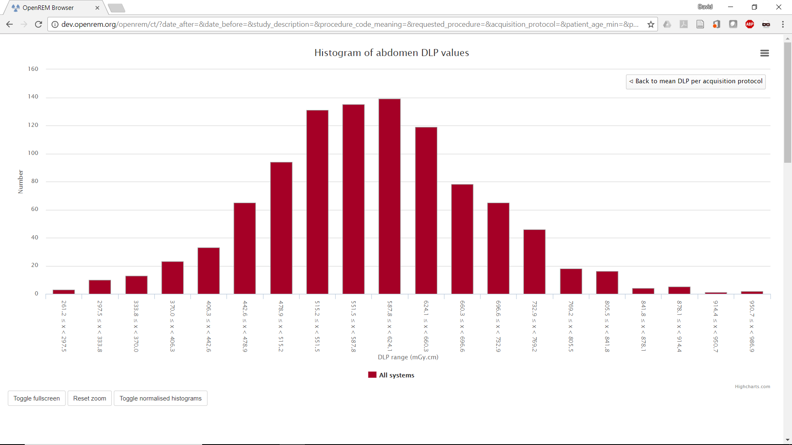
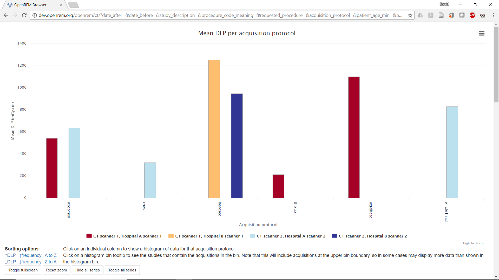
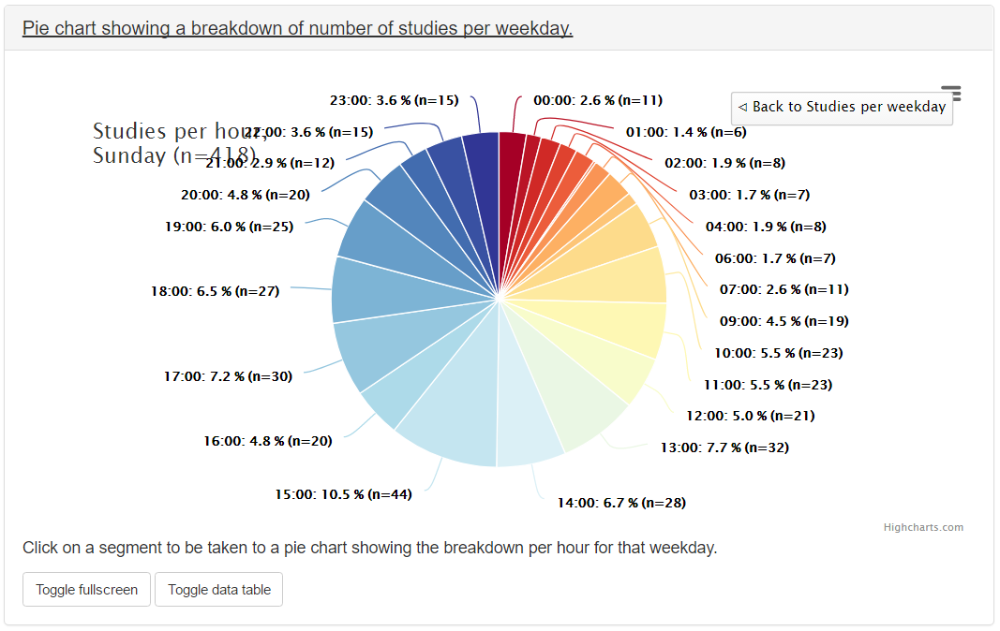
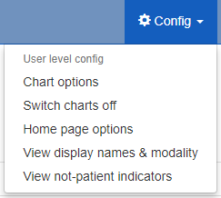

######
Charts
######

***********
Chart types
***********

============================================================
1. Bar chart of average values across a number of categories
============================================================

.. figure:: img/ChartCTMeanDLP.png
   :figwidth: 50%
   :align: right
   :alt: Bar chart of mean DLP per acquisition
   :target: _images/ChartCTMeanDLP.png

   Figure 1: Bar chart of mean DLP per acquisition

An example of mean DAP per acquisition type is shown in figure 1.

.. figure:: img/ChartCTSortingOptions.png
   :figwidth: 50%
   :align: right
   :alt: Bar chart sorting options
   :target: _images/ChartCTSortingOptions.png

   Figure 2: Bar chart sorting options

Below each bar chart there are options to sort the order of the data. This can
be ascending or descending by average value, size of data sample, or
alphabetically (figure 2).

Clicking on an entry in the bar chart legend toggles the display of the
corresponding series on the chart.

   Figure 3: Histogram of abdomen DLP values

If you have histogram calculation switched on then clicking on an individual
data point on a bar chart will take you to a histogram of the data for that
point so that you can see the shape of the value's distribution (figure 3).

Bar charts can be plotted with a series per x-ray system (figure 4). This can
be toggled using the `Plot a series per system` checkbox in the `Chart options`.

Clicking the left-hand mouse button on the chart background and dragging left
or right selects part of the series. Releasing the mouse button zooms in on
this selection. A ``Reset zoom`` button appears when zoomed in: clicking this
resets the chart so that the full series can be seen again. The zoom feature
works on both the main series and the histograms. The zooming can be useful
when there is a category on the chart that has a very low value compared to
others. Zooming in on this category will enable the low values to be seen, as
the chart rescales the y-axis after the zoom.

   Figure 4: Bar chart of mean DLP (one system per series)

Clicking on the `Toggle data table` button toggles the display of an HTML table
containing the data from the current chart. This button is hidden if you are
viewing the chart in full screen mode. An example showing a data table is shown
in figure 5.

   Figure 5: Bar chart with data table displayed

If the the bar chart that you are viewing shows more than one series then
clicking on a category name on the x-axis will take you to a plot that shows
multiple histograms: one for each series (figure 6).

If the bar chart that you are viewing shows more than one series then buttons
are available to `Hide all series`, `Show all series`, and `Toggle all series`.
These provide a quick way to switch which series are being displayed without
having to click on individual series in the chart legend.

.. figure:: img/ChartCTMeanDLPhistogramPerSystem.png
   :figwidth: 50%
   :align: right
   :alt: Histogram of abdomen DLP (one series per system)
   :target: _images/ChartCTMeanDLPhistogramPerSystem.png

   Figure 6: Histogram of abdomen DLP values, one series per system

The histogram data can be plotted as absolute values, or be normalised to a
value of 1.0 (figure 7). This can be toggled by clicking on the button that is
shown below the histogram plots. The normalisation can be useful when trying to
compare the shape of several histograms, especially when some histograms have
much less data than others.

.. figure:: img/ChartCTMeanDLPhistogramPerSystemNorm.png
   :figwidth: 50%
   :align: right
   :alt: Normalised histogram of abdomen DLP (one series per system)
   :target: _images/ChartCTMeanDLPhistogramPerSystemNorm.png

   Figure 7: Normalised histogram of abdomen DLP, one series per system

Each histogram data point includes a text link that appears when the mouse
pointer moves over it. Clicking on this link will filter the displayed studies,
showing those that correspond to what is contained in the histogram bin.

Clicking on a legend entry toggles the visibility of the corresponding series.

Only data with non-zero and non-blank dose values are included in the chart
data calculations.

=============================================================
2. Pie chart showing the frequency of each item in a category
=============================================================

.. figure:: img/ChartCTacquisitionFreq.png
   :figwidth: 50%
   :align: right
   :alt: Pie chart of acquisition frequency
   :target: _images/ChartCTacquisitionFreq.png

   Figure 8: Pie chart of acquisition frequency

Figure 8 shows a pie chart of the number of acquisitions made for every
acquisition protocol present in the tabulated data.

Clicking on any of the pie chart segments will filter the displayed studies,
showing only the studies that correspond to what is contained in that segment.
As for the bar charts, this doesn't work perfectly, as the category filtering
isn't exact.

Only data with non-zero and non-blank dose values are included in the chart
data calculations.

============================================================
3. Line chart showing how an average value changes over time
============================================================

.. figure:: img/ChartCTMeanDLPoverTime.png
   :figwidth: 50%
   :align: right
   :alt: Line chart of mean DLP per study type over time
   :target: _images/ChartCTMeanDLPoverTime.png

   Figure 9: Line chart of mean DLP per study type over time

A line is plotted for each category, with a point calculated every day, week,
month or year. This can be a good way of looking at how things have changed
over time. For example, the mean DLP of each study type, calculated with a
data point per month is shown in figure 9.

Clicking the left-hand mouse button on the chart and dragging left or right
across a range of dates and then releasing the mouse button will zoom in on
that selection.

Clicking on a legend entry toggles the visibility of the corresponding series.

Only data with non-zero and non-blank dose values are included in the chart
data calculations.

=============================================================
4. Pie chart showing the number of events per day of the week
=============================================================

.. figure:: img/ChartCTworkload.png
   :figwidth: 50%
   :align: right
   :alt: Pie chart of study workload per day of the week
   :target: _images/ChartCTworkload.png

   Figure 10: Pie chart of study workload per day of the week

   Figure 11: Pie chart of study workload per hour in a day

Each segment represents a day of the week, and shows the number of events that
have taken place on that day (figure 10). Clicking on one of the segments will
take you to a pie chart that shows the number of events per on that day (figure
11).

All data, including zero blank dose values are included in the data
calculations for this chart type.

=============================================
5. Scatter plot showing one value vs. another
=============================================

   Figure 12: Scatter plot of average glandular dose vs. compressed thickness

   Figure 13: Scatter plot of average glandular dose vs. compressed thickness; one series per system

This plot type shows a data point per event (figure 12). The series name and
data values are shown when the mouse cursor is positioned over a data point.

These can be plotted with a series per x-ray system (figure 13). This can be
toggled using the `Plot a series per system` checkbox in the `Chart options`.

Clicking the left-hand mouse button on the chart and dragging a rectangular
region will zoom in on that selection of the chart. A ``Reset zoom`` button
appears when zoomed in: clicking this resets the chart so that the full series
can be seen again.

Clicking on a system's legend entry toggles the display of the corresponding
series on the chart.

Only data with non-zero and non-blank dose values are included in the chart
data calculations.

********************
Exporting chart data
********************

An image file of a chart can be saved using the menu in the top-right hand side
of any of the charts. The same menu can be used to save the data used to plot a
chart: the data can be downloaded in either csv or xls format.

*************
Chart options
*************

.. figure:: img/ChartOptions.png
   :figwidth: 25 %
   :align: right
   :alt: OpenREM chart options
   :target: _images/ChartOptions.png

   Figure 13: OpenREM chart options

Chart options can be configured by choosing the ``Chart options`` item from the
``User options`` menu on the OpenREM homepage (figure 13).

CT and radiographic plot options can also be set from their respective
summary pages.

The first option, ``Plot charts?``, determines whether any plots are shown.
This also controls whether the data for the plots is calculated by OpenREM.

Switching ``Case-insensitive categories`` on will force chart categories to be
lowercase. This can be helpful if several rooms use the same wording but with
different capitalisation for acquisition protocol, study description or
requested procedure. With this option switched on then all rooms with the same
wording, irrespective of capitalisation, will be shown side-by-side under the
same single category. With the option switched off there will be a seperate
category for each differently capitalised category.

Some plot data is slow to calculate when there is a large amount of data: some
users may prefer to leave ``Plot charts?`` off for performance reasons.
``Plot charts?`` can be switched on and activated with a click of the
``Submit`` button after the data has been filtered.

   Figure 14: Switching charts off

The user can also switch off chart plotting by clicking on the
``Switch charts off`` link in the ``User options`` menu in the navigation bar
at the top of any OpenREM page, as shown in figure 14.

The user can choose whether the data displayed on the charts is the mean,
median or both by using the drop-down ``Average to use`` selection. Only the
bar charts can display both mean and median together. Other charts display just
median data when this option is selected.

The charts can be sorted by either bar height, frequency or alphabetically by
category. The default sorting direction can be set to ascending or descending
using the drop-down list near the top of the ``chart options``.

A user's chart options can also be configured by an administrator via OpenREM's
user administration page.

****************
Chart types - CT
****************

* Bar chart of average DLP for each acquisition protocol (all systems combined)

* Bar chart of average DLP for each acquisition protocol (one series per system)

* Pie chart of the frequency of each acquisition protocol

* Pie chart showing the number of studies carried on each day of the week

* Line chart showing the average DLP of each study name over time

* Bar chart of average CTDI\ :sub:`vol` for each acquisition protocol

* Bar chart of average DLP for each study name

* Pie chart of the frequency of each study name

* Bar chart of average DLP for each requested procedure

* Pie chart of the frequency of each requested procedure

*************************
Chart types - radiography
*************************

* Bar chart of average DAP for each acquisition protocol

* Pie chart of the frequency of each acquisition protocol

* Bar chart of average DAP for each study description

* Pie chart of the frequency of each study description

* Bar chart of average number of irradiation events for each study description

* Bar chart of average DAP for each requested procedure

* Pie chart of the frequency of each requested procedure

* Bar chart of average number of irradiation events for each requested procedure

* Bar chart of average kVp for each acquisition protocol

* Bar chart of average mAs for each acquisition protocol

* Pie chart showing the number of studies carried out per weekday

* Line chart of average DAP of each acquisition protocol over time

* Line chart of average mAs of each acquisition protocol over time

* Line chart of average kVp of each acquisition protocol over time

*************************
Chart types - fluoroscopy
*************************

* Bar chart of average DAP for each study description

* Pie chart of the frequency of each study description

* Pie chart showing the number of studies carried out per weekday

*************************
Chart types - mammography
*************************

* Scatter plot of average glandular dose vs. compressed thickness for each
  acquisition

* Scatter plot of kVp vs. compressed thickness for each
  acquisition

* Scatter plot of mAs vs. compressed thickness for each
  acquisition

* Pie chart showing the number of studies carried out per weekday

*****************
Performance notes
*****************

===============
All chart types
===============

For any study- or request-based charts, filtering using `Acquisition protocol`
forces OpenREM to use a much slower method of querying the database for chart
data. Where possible avoid filtering using this field, especially when viewing
a large amount of data.

==========
Bar charts
==========

Switching off histogram calculation in `Chart options` will speed up bar chart
data calculation.

Switching off `Plot a series per system` in the `Chart options` will speed up
data calculation.

=============
Scatter plots
=============

Switching off `Plot a series per system` in the `Chart options` will speed up
data calculation.
