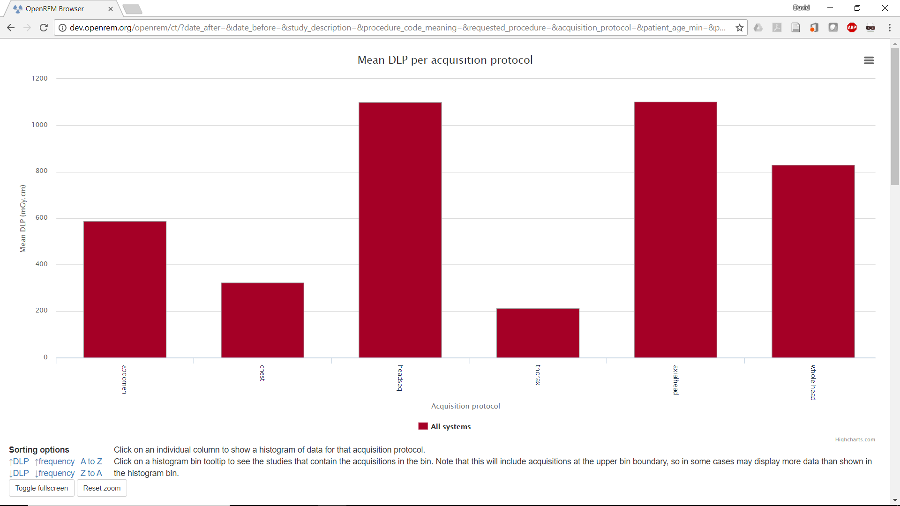
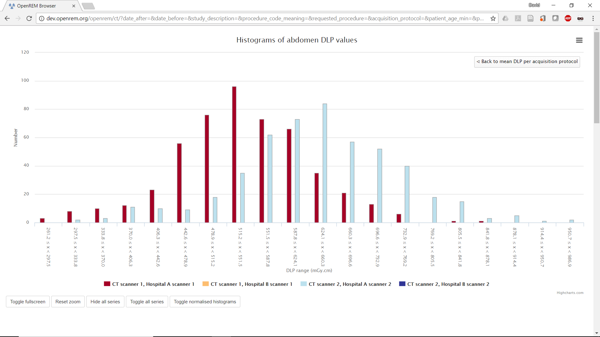
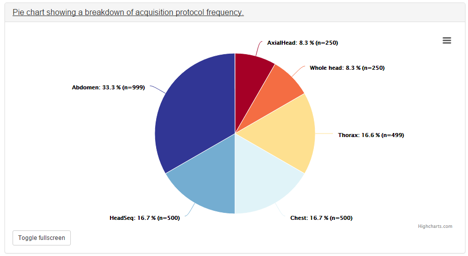
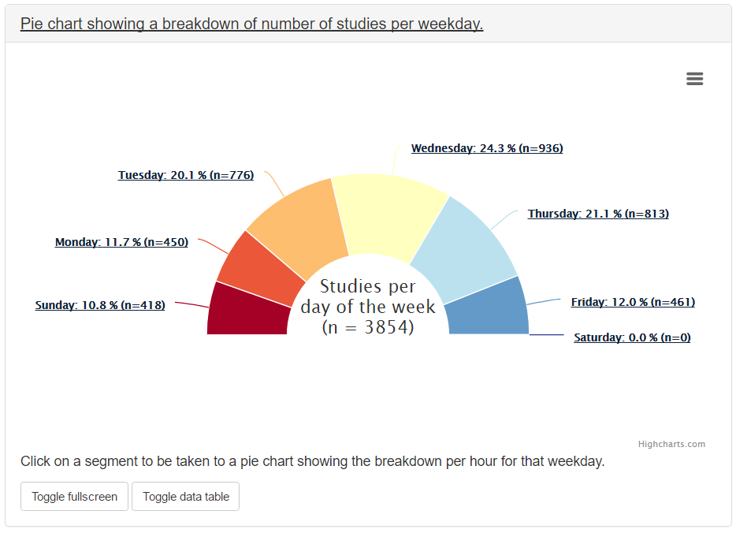

######
Charts
######

***********
Chart types
***********

=========================================================
1. Bar chart of average values across a number of categories
=========================================================

For example, median DAP per requested procedure name. Below each bar chart
there are options to sort the order of the data. This can be by average value,
size of data sample, or alphabetically.

Clicking on an entry in the bar chart entry toggles the display of the
corresponding series on the chart.

Clicking on an individual data point on one of these charts will take you to a
histogram of the data for that point so that you can see the shape of the
value's distribution.

If the the bar chart that you are viewing shows more than one series then
clicking on a category name on the x-axis will take you to a plot that shows
multiple histograms: one for each series.

The histogram data can be plotted as absolute values, or be normalised to a
value of 1.0. This can be toggled by clicking on the button that is shown below
the histogram plots. The normalisation can be useful when trying to compare the
shape of several histograms.

Each histogram data point includes a text link that appears when the mouse
pointer moves over it. Clicking on this link will filter the displayed studies,
showing only the studies that correspond to what is contained in that histogram
point. This doesn't work perfectly, as the category filtering isn't exact. For
example, the histogram data point may be for requests called "CT chest" with a
DLP between 100 and 150 mGy.cm. Clicking on this point's link will show you all
studies you expect, but it will also include any request for "CT chest with
contrast" that have a DLP between 100 and 150 mGy.cm, together with any other
studies who's requests begin with "CT chest" and match the DLP criteria.

Clicking on a legend entry toggles the visibility of the corresponding series.

=============================================================
2. Pie chart showing the frequency of each item in a category
=============================================================

For example, the number of aquisitions made for every acquisition protocol
present in the tablulated data.

Clicking on any of the pie chart segments will filter the displayed studies,
showing only the studies that correspond to what is contained in that segment.
As for the bar charts, this doesn't work perfectly, as the category filtering
isn't exact.

============================================================
3. Line chart showing how an average value changes over time
============================================================

For example, the mean DAP of each requested procedure name, calculated with a
data point per month.

A line is plotted for each category, with a point calculated every day, week,
month or year. This can be a good way of looking at how things have changed
over time.

Clicking the left-hand mouse button on the chart and dragging left or right
across a range of dates and then releasing the mouse button will zoom in on
that selection.

Clicking on a legend entry toggles the visibility of the corresponding series.

=============================================================
4. Pie chart showing the number of events per day of the week
=============================================================

For example, the number of studies carried out on each day of the week.

Clicking on a segment takes you to a pie chart that shows the number of events
per hour over that day.

********************
Exporting chart data
********************

An image file of a chart can be saved using the menu in the top-right hand side
of any of the charts. The same menu can be used to save the data used to plot a
chart: the data can be downloaded in either csv or xls format.

************
New in 0.7.0
************

* Chart plotting options can be configured by choosing ``Chart options`` from
  the ``User options`` menu at the top of the OpenREM homepage.

* Chart average values can be set to either mean or median. Bar charts can be
  configured to plot both mean and median values as seperate series.

* Bar charts can be plotted with a series per x-ray system. This option can be
  switched on or off via the ``Chart options``.

* The the number of histogram data bins can be set to a value between 2 and 40
  in ``Chart options``. The default value is 20.

* Histogram plots can toggle between absolute or normalised values via the
  ``Toggle Normalised histograms`` button that is visible when viewing a
  histogram plot.

* The data in the bar charts can be sorted interactively by clicking on the
  sorting options below the individual chart. The default sorting type and
  direction can be set by choosing the ``Chart options`` item from the
  ``User options`` menu on the OpenREM homepage.

* Individual charts can be displayed full-screen by clicking on the
  ``Toggle fullscreen`` button that is positioned below each chart.

* The chart plotting status is displayed on the OpenREM homepage.

* The colours used for plotting have been updated.

*************
Chart options
*************

Chart options can be configured by choosing the ``Chart options`` item from the
``User options`` menu on the OpenREM homepage:

.. image:: img/ChartOptions.png
   :width: 352px
   :align: center
   :height: 944px
   :alt: OpenREM chart options screenshot

They can also be set via the CT and Radiographic summary pages:

.. image:: img/ChartCTOptions.png
   :width: 297px
   :align: center
   :height: 376px
   :alt: OpenREM CT chart options screenshot

The first option, ``Plot charts?``, determines whether any plots are shown.
This also controls whether the data for the plots is calculated by OpenREM.
Some plot data is slow to calculate when there is a large amount of data: some
users may prefer to leave ``Plot charts?`` off for performance reasons.
``Plot charts?`` can be switched on and activated with a click of the
``Submit`` button after the data has been filtered.

The user can switch off all chart plotting by clicking on the
``Switch charts off`` link in the ``User options`` menu in the navigation bar
at the top of any OpenREM page. Clicking on this link takes the user back to
the home page.

The user can choose whether the data displayed on the charts is the mean, 
median or both by using the drop-down ``Average to use`` selection. Only the
bar charts can display both mean and median together. Other charts display just
median data when this option is selected.

The charts can be sorted by either bar height, frequency or alphabetically by
category. The default sorting direction can be set to ascending or descending
using the drop-down list near the top of the ``chart options``.

A user's chart options can also be configured by an administrator via OpenREM's
user administration page.

****************
Chart types - CT
****************

=============================================================================
Bar chart of average DLP for each acquisition protocol (all systems combined)
=============================================================================

The tooltip of each bar shows the user the name of the protocol, the number of
acquisitions of that type and also the mean or median DLP.

Clicking on an individual bar takes the user to a histogram of DLP for that
protocol. The tooltip for each histogram bar shows the number of acquisitions.
The histogram tooltip also includes a link that will take the user to the list
of studies that contain the acquisitions represented by that histogram bar:

.. image:: img/ChartCTMeanDLPhistogram.png
   :width: 930px
   :align: center
   :height: 511px
   :alt: OpenREM histogram of acquisition DLP screenshot

==============================================================================
Bar chart of average DLP for each acquisition protocol (one series per system)
==============================================================================

Ticking the ``Plot a series per system`` box in the ``Chart options`` will result
in plots that have a data series per x-ray system for all charts that plot
dose, mAs or kVp against some category.

.. image:: img/ChartCTMeanDLPperSystem.png
   :width: 930px
   :align: center
   :height: 592px
   :alt: OpenREM chart of mean DLP (one system per series) screenshot

Clicking on an x-axis label of one of a plot with a series per x-ray system
will take you to a plot with a histogram per x-ray system:

Clicking on the ``Toggle normalisation`` button when viewing a histogram will
normalise all of the series to a maximum value of 1.0. This can sometimes make
it easier to compare one distribution with another:

.. image:: img/ChartCTMeanDLPhistogramPerSystemNorm.png
   :width: 926px
   :align: center
   :height: 515px
   :alt: OpenREM normalised histogram of acquisition DLP (one series per system) screenshot

=======================================================
Pie chart of the frequency of each acquisition protocol
=======================================================

Clicking on a segment of the pie chart takes the user to the list of studies
that contain the acquisitions in that segment.

=======================================================================
Pie chart showing the number of studies carried on each day of the week
=======================================================================

Clicking on a segment of the pie chart takes the user to a pie chart showing
the studies for that weekday broken down per hour:

.. image:: img/ChartCTworkload24hours.png
   :width: 932px
   :align: center
   :height: 542px
   :alt: OpenREM pie chart of study workload per hour in a day screenshot

===============================================================   
Line chart showing the average DLP of each study name over time
===============================================================

The time period per data point is chosen by the user in the ``Chart options``.
Note that selecting a short time period may result in long calculation times.
The user can zoom in to the plot by clicking and dragging the mouse to select a
date range. The user can also click on items in the chart legend to show or
hide individual lines.

.. image:: img/ChartCTMeanDLPoverTime.png
   :width: 932px
   :align: center
   :height: 542px
   :alt: OpenREM line chart of mean DLP per study type over time screenshot
      
===============
Other CT charts
===============

* Bar chart of average CTDI\ :sub:`vol` for each acquisition protocol

* Bar chart of average DLP for each study name

* Pie chart of the frequency of each study name

* Bar chart of average DLP for each requested procedure

* Pie chart of the frequency of each requested procedure

*************************
Chart types - radiography
*************************

* Bar chart of average DAP for each acquisition protocol

* Pie chart of the frequency of each acquisition protocol

* Bar chart of average DAP for each study description

* Pie chart of the frequency of each study description

* Bar chart of average DAP for each requested procedure

* Pie chart of the frequency of each requested procedure

* Bar chart of average kVp for each acquisition protocol

* Bar chart of average mAs for each acquisition protocol

* Pie chart showing the number of studies carried out per weekday

* Line chart of average DAP of each acquisition protocol over time

* Line chart of average mAs of each acquisition protocol over time

* Line chart of average kVp of each acquisition protocol over time
