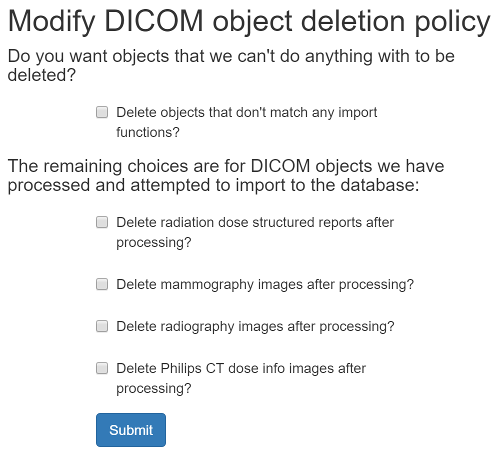
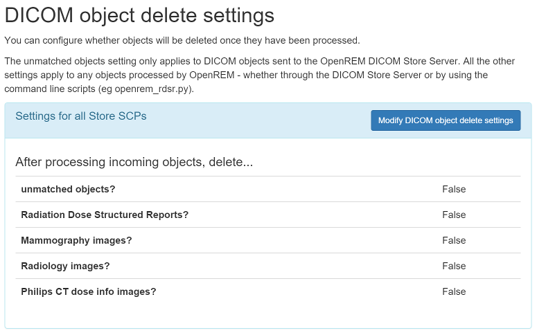

############################
Delete objects configuration
############################

OpenREM is able to automatically delete DICOM objects if they can't be used by OpenREM or if they have been processed.
This has the following advantages:

* The server doesn't need to have much storage space
* It can help with information governance if the database is set to not store patient identifiable data (see
  :doc:`patientid`)

.. warning::
    If OpenREM is set to delete objects and you pass a local file to OpenREM using the command line, the source file
    will be deleted (as long as the filesystem permissions allow).

*************************
Configure what is deleted
*************************

.. figure:: img/ConfigMenu.png
    :figwidth: 30 %
    :align: right
    :alt: Config menu

    The ``Config`` menu

Use the ``Config`` menu and select ``DICOM object deletion``:

This will open the configuration page:

    Modify DICOM object deletion policy

.. raw:: html

    

The initial settings are to not delete anything. However, you are likely to want to delete objects that don't match any
import filters, and also to delete images such as mammo, DX and Philips CT, as these will take up space much more
quickly than the radiation dose structured reports.

**********************
Reviewing the settings
**********************

When you have set your preferences, you will be redirected to the DICOM network configuration page, where at the bottom
you can review the current settings:

    Deletion policies can be reviewed on the DICOM network configuration page

More information about the DICOM network configuration can be found on the :doc:`netdicom` page.