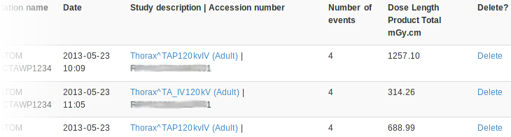
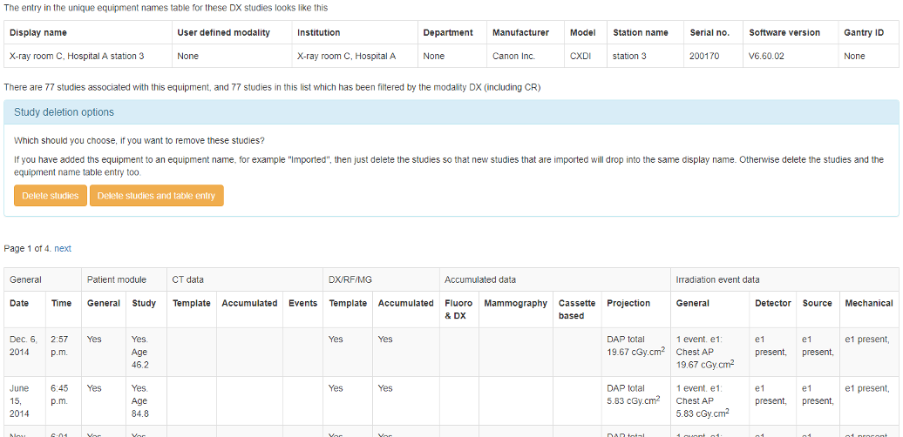

****************
Deleting studies
****************

Individual studies
==================

If you log in as a user that is in the ``admingroup``, then an extra column is appended in
the filtered view tables to allow studies to be deleted:

Clicking on delete takes you to a confirmation page before the delete takes place.

All studies from one source
===========================

.. figure:: img/ConfigMenu.png
   :align: right
   :alt: Admin menu
   :width: 179px

   The ``Config`` menu (admin)

If you log in as a user that is in the ``admingroup``, on the ``Config`` menu select ``Display names & modality`` to
get to a list of all the X-ray systems with data in OpenREM. More information about :doc:`i_displaynames`.

Each row is a unique combination of all the column headers, so if a modality has a software update for example this will
usually mean a new row is started.

In the last column is a link to ``Review`` the studies from that source. This can be useful for troubleshooting a
particular source, or you can use it to delete all the studies from one source in one go.

   Source equipment review page with study delete options

The details for that source are displayed, along with a table showing which sort of data is contained in each study.
This works no-matter which modality the data comes from.

Delete studies and table entry
------------------------------

Use this button if you want to delete all the studies and remove the entry that has been made in the Unique Equipment
Names table. Otherwise, the entry would remain but with zero studies associated with it. The deletion takes a second
confirmation step.

Delete studies
--------------

If you have associated this table entry with a ``Display name`` and you want any future studies to fall under the same
name, you can leave the entry in the Unique Equipment Names table. You might want to do this for example if you have
a Display name of 'CR' or 'Imported'. Again, there is a confirmation step.