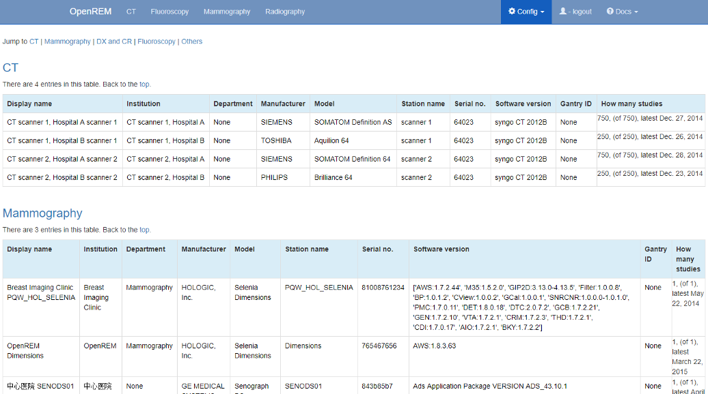

Viewing and editing individual x-ray system display names using the web interface
*********************************************************************************
*New in 0.7.0*

.. contents::

The display name field
======================

Previous versions of OpenREM used each x-ray system's DICOM ``station name`` as
the identifier for each x-ray system. The front page showed a summary of the
number of studies for each unique ``station name`` stored in the system.
This led to a problem if multiple x-ray systems used the same station name: the
OpenREM home page would only show one station name entry for these systems,
with the number of studies corresponding to the total from all the rooms. The
name shown alongside the total was that of the system that had most recently
sent data to the system.

This issue has been resolved by introducing a new field called
``display name``. This is unique to each piece of x-ray equipment, based on the
combination of the following eight fields:

    * manufacturer
    * institution name
    * station name
    * department name
    * model name
    * device serial number
    * software version 
    * gantry id

The default text for ``display name`` is set to a combination of
``institution name`` and ``station name``.

Viewing x-ray system display names
==================================

.. image:: img/UserOptionsMenu.png
    :align: right
    :alt: User options menu
    :width: 177px
    :height: 154px

If you log in as a normal user then the ``User options`` menu becomes available
at the right-hand end of the navigation bar at the top of the screen:

The third option, ``View display names``, takes you to a page where you can
view the list of x-ray systems with data in OpenREM together with their
current display name.

Changing x-ray system display names
===================================

.. image:: img/AdminMenu.png
    :align: right
    :alt: Admin menu
    :width: 284px
    :height: 153px

If you wish to make changes to a display name then you must log in as a user
that is in the ``admingroup``. You will then be able to use the
``View and edit display names`` item under the ``Admin`` menu:

This will take you to a page where you can view the list of x-ray systems with
data in OpenREM. If you wish to change a display name then click on the
corresponding row. The resulting page will allow you to edit the display name.
Click on the ``Update`` button to confirm your changes:

.. image:: img/UpdateDisplayName.png
    :align: center
    :alt: Update a display name
    :width: 1080px
    :height: 193px
