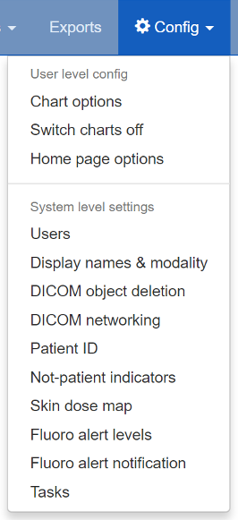
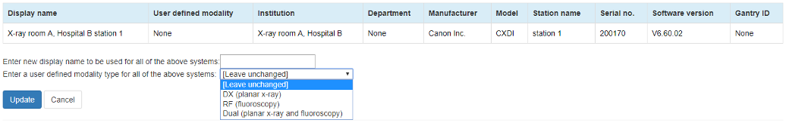
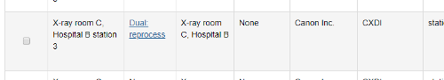

Display names and user-defined modalities
*****************************************
*Functionality changed in 0.8.0*

.. contents::

The display name field
======================

Previous versions of OpenREM used each X-ray system's DICOM ``station name`` as
the identifier for each X-ray system. The front page showed a summary of the
number of studies for each unique ``station name`` stored in the system.
This led to a problem if multiple X-ray systems used the same station name: the
OpenREM home page would only show one station name entry for these systems,
with the number of studies corresponding to the total from all the rooms. The
name shown alongside the total was that of the system that had most recently
sent data to the system.

This issue has been resolved by introducing a new field called
``display name``. This is unique to each piece of X-ray equipment, based on the
combination of the following eight fields:

    * manufacturer
    * institution name
    * station name
    * department name
    * model name
    * device serial number
    * software version
    * gantry id

The default text for ``display name`` is set to a combination of
``institution name`` and ``station name``. The default display name text can be changed by a user in the ``admingroup``
— see :ref:`changing_display_names`

User defined modality field
===========================

OpenREM determines the modality type of a system based on the information in
the DICOM radiation dose structured report. However sometimes this mechanism fails
because vendors use templates meant for RF also for DX systems. Therefore it
is possible from version 0.8.0 to set a modality type for each system manually.
A manually set modality type overrides the automatically determined value.

Viewing X-ray system display names and user defined modality
============================================================

.. figure:: img/UserOptionsMenu.png
   :align: right
   :alt: User options menu
   :width: 179px

   The ``Config`` menu (user)

If you log in as a normal user then the ``Config`` menu becomes available
at the right-hand end of the navigation bar at the top of the screen.

The third option, ``View display names & modality``, takes you to a page where
you can view the list of X-ray systems with data in OpenREM together with their
current display name and user defined modality. If the user defined modality
is not set, the value contains ``None``. The X-ray systems are grouped
into modalities and displayed in five tables: CT; mammography; DX and CR;
fluoroscopy; and other.

.. figure:: img/DisplayNameList.png
   :align: center
   :alt: List of current display names
   :width: 1036px

   Example list of display names

.. _changing_display_names:

Changing X-ray system display names and user defined modality
=============================================================

   The ``Config`` menu (admin)

If you wish to make changes to a display name or to the user defined
modality then you must log in as a user that is in the ``admingroup``. You will
then be able to use the ``Display names & modality`` item under the
``Config`` menu:

.. raw:: html

    

This will take you to a page where you can view the list of X-ray systems with
data in OpenREM. If you wish to change a display name or the user defined modality
then click on the corresponding row. The resulting page will allow you to
edit these parameters. Click on the ``Update`` button to confirm your changes:

   Example of the page for updating a display name and user defined modality

You can change multiple rows at once. For display names you may wish to do this
if a system has a software upgrade, for example, as this will generate a new
default display name for studies carried out after the software upgrade has
taken place. The studies from these will be grouped together as a single entry
on the OpenREM homepage and individual modality pages.

If you update the user defined modality, the modality type for already imported
studies will also be set to the user defined modality type. Only changes
from modality DX (planar X-ray) to RF (fluoroscopy) and vice versa are possible.

Dual modality systems
---------------------

Some systems are dual purpose in that they can be used in both standard planar X-ray mode and in fluoroscopy mode. For
these systems you can configure them as 'Dual' and OpenREM will attempt to reprocess all the studies related to the rows
you have selected and assign them to DX or RF. The studies will then be displayed in the right sections in the web
interface and will export correctly. New RDSRs relating to that X-ray system will be assigned a modality in the same
way.

After an X-ray system has been set to Dual you may wish to reprocess the studies to assign modality again. To do this
you can use the 'reprocess' link in the 'User defined modality' cell:

    Re-sort studies into planar X-ray and fluoroscopy