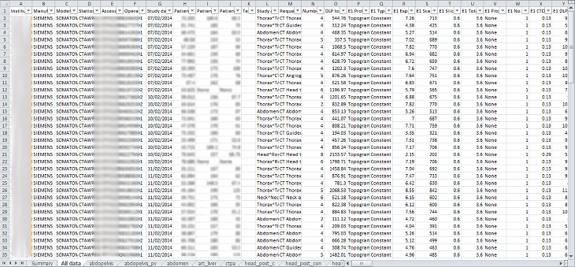
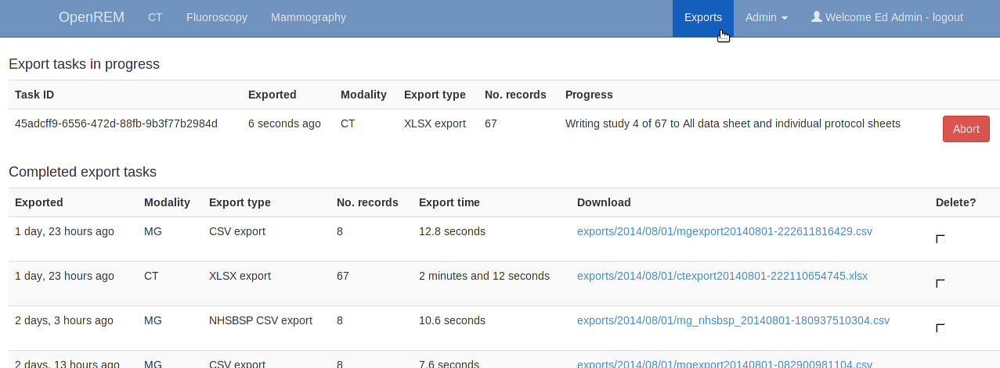
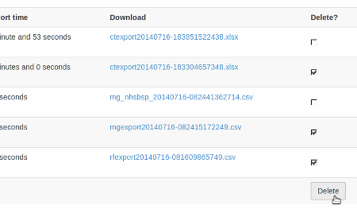

Exporting study information
***************************

Exporting to csv and xlsx sheets
================================

If you are logged in as a user in the ``exportgroup`` or the ``admingroup``,
the export links will be available near the top of the modality filter pages
in the OpenREM interface.

For each modality you can export to a single-sheet csv file or a multi-sheet xlsx file. In addition, there is an export
tailored to the :ref:`NHSBSP_dose_audit` requirements.

If you are logged in as a user in the ``pidgroup`` you will also have a choice of exporting with patient name and/or
patient ID information included in the export (if any is recorded in the database). See :doc:`patientid` for more
details.

The xlsx export has multiple sheets. The first sheet contains a
summary of all the study descriptions, requested procedures and series
protocol names contained in the export:

.. image:: img/CTExportSummaryPage.png
    :width: 730px
    :align: center
    :height: 339px
    :alt: CT export front sheet
    
This information is useful for seeing what data is in the spreadsheet, and
can also be used to prioritise which studies or protocols to analyse based on
frequency.

The second sheet of the exported file lists all the studies, with each study
taking one line and each series in the study displayed in the columns to the right.

The remainder of the file has one sheet per series protocol name. Each series
is listed one per line. If a single study
has more than one series with the same protocol name, then the same study
will appear on more than one line.

Fluoroscopy exports
-------------------

Fluoroscopy csv exports only report study level information — this includes summary dose information for fluoroscopy
exposures and acquisition exposures, but not information about individual exposures.

Fluoroscopy xlsx exports contain the following sheets:

- Summary sheet
- All data sheet with groups of exposures
- One sheet per acquisition protocol with one row per exposure including all the details of that exposure.

Exposures are considered similar and put in the same group if they are, relative to the first exposure of a group:

- same plane (for bi-plane systems)
- same protocol
- same field size (mag, not collimation)
- same pulse rate
- same filter material and thickness
- within 5° in both directions (primary and secondary)
- of the same 'event type' (Fluoroscopy, Stationary Acquisition, Stepping Acquisition, Rotational Acquisition)

The minimum, maximum and mean of all the remaining factors are presented for each group along with the common factors.
Where a factor is not available in the source RDSR, that factor is not considered.

The grouping process for the all data sheet takes a lot of time compared to the other exports. However, we hope that
this is a useful way of comprehending the study. Other modalities have all the series for any one study detailed in full
on one long row — this is not possible when one study might have 400 exposures!

The majority of systems report kV, mA and pulse width information as a mean value per exposure. Some systems report
this information on a per pulse basis instead. In this circumstance, in the web interface you will see the list of
pulses, but in the export the mean value (after excluding any zero values) is calculated first and this value is then
used.

Exports page
------------

Clicking the link for an export redirects you to the Exports page, which
you can also get to using the link at the top right of the navigation bar:

Whilst an export is being processed, it will be listed in the first table at the top. The current status is displayed to
indicate export progress, and is updated every two seconds. You can stop an export early by using the abort button;  you
will not be able to download anything in this instance.

Once a study is complete a new table of recently completed exams is created and you will be able to download the file.

When the export is no longer needed, it can be deleted from the server
by ticking the delete checkbox and clicking the delete button at the bottom:

Specific modality export information
====================================

..  _NHSBSP_dose_audit:

NHSBSP dose audits
------------------

This export is specific to the UK NHS Breast Screening Programme and generates the source data in the format required
for the  dose audit database developed by the National Co-ordinating Centre for the Physics of Mammography.

It has been modified to clean up the data to remove exposures that are unlikely to be wanted in the submitted data, such
as exposures with any of the following in the protocol name::

    scout, postclip, prefire, biopsy, postfire, stereo, specimin, artefact

The view codes have been modified to match the NCCPM convention, i.e. medio-lateral oblique is recorded as ``OB`` instead
of ``MLO``. The other codes are mapped to the `ACR MQCM 1999 Equivalent code.`_

Each patient is numbered from starting from 1. Each view for any one patient has a unique view code, so if a second
cranio-caudal exposure is made to the left breast the view codes will be LCC and LCC2.

The survey number is left as 1. This needs to be modified as appropriate. The easiest way to do this in Excel is to
change the first two or three rows, select those cells that have been changed, then double click on the bottom-right
corner of the selection box to copy-down the value to all the remaining cells below.

The data can then be copied and pasted into the NCCPM database.

If there are a mixture of 2D and tomography exposures, providing you can separate them by virtue of the filter used,
then you should further prepare the data as follows:

#. Copy the sheet to a new sheet
#. In the first sheet, filter for the target and filter combination used for used for the tomographic exposures and
   delete those rows.
#. In the second sheet, filter for the target and filter combinations used for 2D exposures and delete those rows.
#. Change the survey number on the 2D sheet and the the survey number on the tomographic sheet as appropriate, with the
   tomographic survey number bing one more than the 2D survey number.

Where patients have had both 2D and tomographic exposures in the same study, NCCPM will be able to match them up as they
will have the same patient number in both surveys.

PHE 2019 CT survey
------------------

This export is specific to the UK Public Health England (PHE) CT dose audit and exports the data in the correct
format to copy and paste into the spreadsheet provided by PHE. More information about the survey and copies of the
data collection spreadsheet can be found on the `CT User Group (CTUG) website`_.

The introduction and guidance tabs of the PHE data collection spreadsheet
should be read and the 'Your details' sheet completed. Then the 'Patient and Protocol data 1' sheet
should be copied and renamed appropriately for each protocol and scanner combination that you will be submitting.
The first 142 rows of each sheet should be filled in manually with all the details for that protocol, though looking at
study data in OpenREM may help to answer some of the questions.

The CT studies should then be filtered in OpenREM; by date (ideally previous 12 months, no older than 2017), by scanner
(each scanner and protocol combination should be a new sheet), by minimum age of 16, and by study description (or
combination of factors to specify a particular protocol). The guidance specifies patients between 50 to 90 kg -- if you
have weight data in OpenREM this filter could be added, but the values form part of the output anyway so it isn't
essential. It  however enable filtering out of those studies that don't have weight data if the majority does. If
patient weight data isn't available in OpenREM then just ensure the sample is large!

Finally the studies should be filtered to have exactly the right number of each type of acquisition for that protocol.
This might be one spiral, one localiser and two stationary (bolus tracking) acquisitions for example. Localisers do not
appear in the export so are less important to specify, but more localisers than usual might indicate a deviation from
the standard protocol.

The export can then be started and monitored in the normal way by clicking on the 'PHE 2019 survey' button. The
resulting export will be in xlsx format, with one header row. The data from row 2 onwards can be copied and pasted
directly into row 150 onwards of the Patient and Protocol sheet of the PHE data collection spreadsheet. Column AL is
for patient comments. OpenREM uses this cell to record the series types that have been exported for each study. This
can therefore be used to double check the data is as you expect it to be. If the protocol has more than four series
excluding localisers, the data is continued in the same format from column AM onwards.

Opening csv exports in Excel
============================

If the export contains non-ASCII characters, then Microsoft Excel is unlikely to display them correctly by default. This
issue does not occur with Libre Office which defaults to UTF-8 -- behaviour with other applications will vary.

To correctly render characters in csv files with Excel, you will need to follow the following procedure:

#. Open Excel.
#. On the ``Data`` tab of the ribbon interface, select ``From Text`` in the ``Get External Data`` section.
#. Select your exported csv file and click ``Import``
#. Ensure that Data Type ``Delimited`` is selected.
#. Change the ``File origin`` from to ``65001 : Unicode (UTF-8)`` -- the easiest way to find it is to
   scroll right to the bottom of the list, then move up one.
#. Click ``Next >``
#. Change the delimiter to just ``Comma``
#. Either click ``Finish`` or ``Next >`` if you want to further customise the import.

..  _`#116`: https://bitbucket.org/openrem/openrem/issue/116/
..  _ACR MQCM 1999 Equivalent code.: http://dicom.nema.org/medical/dicom/current/output/chtml/part16/sect_CID_4014.html
..  _CT User Group (CTUG) website: http://ctug.org.uk/ctsurvey.html