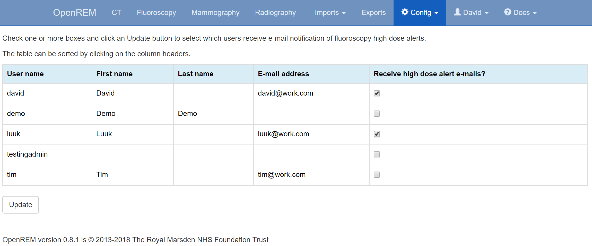

Fluroscopy high dose alerts
***************************
*New in 0.8.2*

.. contents::

Alert level configuration
=========================

.. figure:: img/ConfigMenu.png
   :figwidth: 30%
   :align: right
   :alt: Config options
   :target: _images/ConfigMenu.png

   Figure 1: The ``Config`` menu (user and admin)

The system highlights fluoroscopy studies that have exceeded defined levels of
DAP and total dose at reference point. These alert levels can be configured by
an OpenREM administrator via the `Fluoro alert levels` option in the ``Config``
menu (figure 1).

The default alert levels are 20000 cGy.cm\ :sup:`2` DAP and 2 Gy total dose at
reference point (figure 2).

.. figure:: img/fluoroHighDoseAlertSettings.png
   :figwidth: 100%
   :align: center
   :alt: Fluoroscopy high dose alert settings
   :target: _images/fluoroHighDoseAlertSettings.png

   Figure 2: Fluoroscopy high dose alert settings

Figures 3 and 4 illustrate how studies that exceed an alert level are
highlighted in the filtered and detailed fluoroscopy views.

   Figure 3: Filtered view showing the highlighting of some high dose studies

.. figure:: img/fluoroHighDoseAlertDetailedView.png
   :figwidth: 100%
   :align: center
   :alt: Detailed view showing high-dose highlighting
   :target: _images/fluoroHighDoseAlertDetailedView.png

   Figure 4: Detailed view showing high-dose highlighting

Alerts for cumulative dose over a period of time
================================================

As well as alerting to individual studies that exceed alert levels the system
can be configured to calculate cumulative dose over a defined number of weeks
for studies with matching patient IDs. When this is activated, for each study
OpenREM looks for earlier fluoroscopy studies that have taken place that share
the same patient ID, or encrypted patient ID, and sums the study DAP and total
dose at reference point values. The time period that is used is configured by
an OpenREM administrator, and defaults to 12 weeks (figure 2).

For this feature to work the storage of patient ID or encrypted patient ID must
be enabled (see the :doc:`patientid` documentation).

The configuration settings for this feature are (figure 2):

* The number of previous weeks over which to sum DAP and dose at RP for studies
  with matching patient ID is defined in the options

* The display of summed DAP and dose at RP values in the fluoroscopy filtered
  and detailed views, and in e-mail notifications

* The automatic calculation of summed DAP and dose at RP for new studies
  imported into OpenREM

An example of a study where there is another study with matching patient ID is
shown below in figure 5. In this example neither of the two individual studies
had doses that exceeded an alert level, but when summed together the total dose
at RP does exceed the corresponding alert.

   Figure 5: Detailed view showing associated studies over a time period

Recalculation of summed data
============================

After upgrading from a version of OpenREM prior to 0.8.2, or after changing
the alert levels or number of weeks to look for matching data, the summed
dose values must be recalculated. The user is prompted to do this via the
display of an orange button, as shown in figure 6 below. If settings have
changed an information message is also displayed at the top of the screen.

.. figure:: img/fluoroHighDoseAlertSettingsRecalculate.png
   :figwidth: 100%
   :align: center
   :alt: Prompt to recalculate the summed dose values
   :target: _images/fluoroHighDoseAlertSettingsRecalculate.png

   Figure 6: Prompt to recalculate the summed dose values

Recalculation of the summed data is likely to take several minutes. During this
time the form buttons are faded out and disabled, and a spinning icon is shown
in the middle of the page (figure 7). The user must remain on this page until
the calculations are complete.

.. figure:: img/fluoroHighDoseAlertSettingsRecalculating.png
   :figwidth: 100%
   :align: center
   :alt: Recalculating the summed dose values
   :target: _images/fluoroHighDoseAlertSettingsRecalculating.png

   Figure 7: Prompt to recalculate the summed dose values

Once all summed data has been recalculated the orange recalculate button is
hidden, the other form buttons are reactivated and the user is shown a
success message at the top of the screen (figure 8, below).

.. figure:: img/fluoroHighDoseAlertSettingsRecalculated.png
   :figwidth: 100%
   :align: center
   :alt: Recalculating the summed dose values
   :target: _images/fluoroHighDoseAlertSettingsRecalculated.png

   Figure 8: Message on successful recalculation

E-mail notifications of high dose alerts
========================================

For this feature to function the e-mail section in ``local_settings.py`` must
be correctly completed (see the :ref:`email_configuration` documentation) and
the e-mail server must allow sending of messages that originate from the
OpenREM server, or from the authenticated user specified in the e-mail
settings.

OpenREM users can be automatically sent e-mail notifications of studies that
have exceeded a high dose alert level. This feature can be enabled or disabled
by an OpenREM administrator on the `High dose alerts` configuration page as
shown in figure 2 above.

Alert recipients users are chosen by navigating to the `Fluoro alert notifcation`
page via the `Config` menu. Figure 9 shows an example of the notification page.

It should be noted that any OpenREM user selected to receive high dose alerts
must have an e-mail address entered in their user profile.

   Figure 9: E-mail user-notification of high-dose alerts
