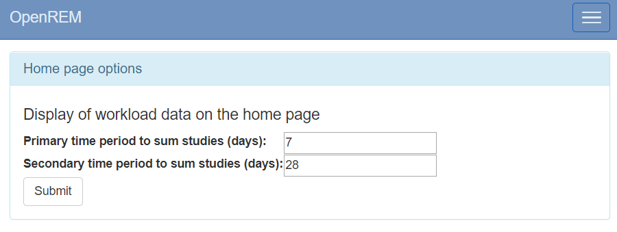

Home page options
*****************
*New in 0.8.2*

.. contents::

Display of workload information
===============================

.. figure:: img/ConfigMenu.png
   :figwidth: 30%
   :align: right
   :alt: Config options

   Figure 1: The ``Config`` menu (user and admin)

The home page can be configured to show the number of studies carried out in
the past 7 (default) and 28 (default) days for each system. These default
values can be changed by logging in, clicking on the ``Config`` menu at the
right-hand end of the navigation bar, and then selecting the ``Home page
options`` entry under ``User level config`` shown in the upper section of
figure 1. This takes the user to a page where the two time periods can be
viewed and updated (figure 2).

By default the display of workload information is disabled. This setting can be
changed by an OpenREM administrator via the ``Home page options`` entry under
the ``System level settings`` section of the ``Config`` menu (lower portion of
figure 1). This brings up a simple form where the current setting can viewed
and modified.

   Figure 2: The home page options form

