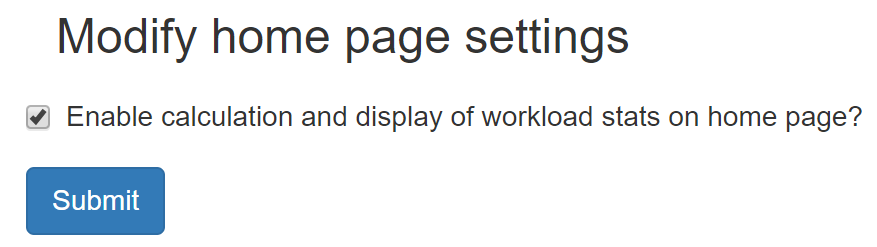

Home page options
*****************
*New in 0.8.2*

.. contents::

Display of workload information
===============================

.. figure:: img/UserOptionsMenu.png
   :figwidth: 30%
   :align: right
   :alt: User options menu

   Figure 1: the ``Config`` menu (user)

The home page can be configured to show the number of studies carried out in
the past 7 and 28 days for each system. These default values can be changed by
logging in, clicking on the ``Config`` menu at the right-hand end of the
navigation bar, and then selecting the ``Home page options`` entry as shown in
figure 1. This takes you to a page where you can view and edit the two time
periods, as shown in figure 2.

.. figure:: img/homePageOptions.png
   :figwidth: 100%
   :align: center
   :alt: List of current display names

   Figure 2: The home page options form

.. figure:: img/ConfigMenu.png
   :figwidth: 30%
   :align: right
   :alt: Admin menu

   Figure 3: The ``Config`` menu (admin)

By default the display of workload information is switched off. It can be
enabled or disabled by an OpenREM administrator via the ``Home page options``
entry in the ``System level settings`` config menu (figure 3). This brings up
a form where the current settings can be seen or modified (figure 4).

   Figure 4: Home page admin settings

