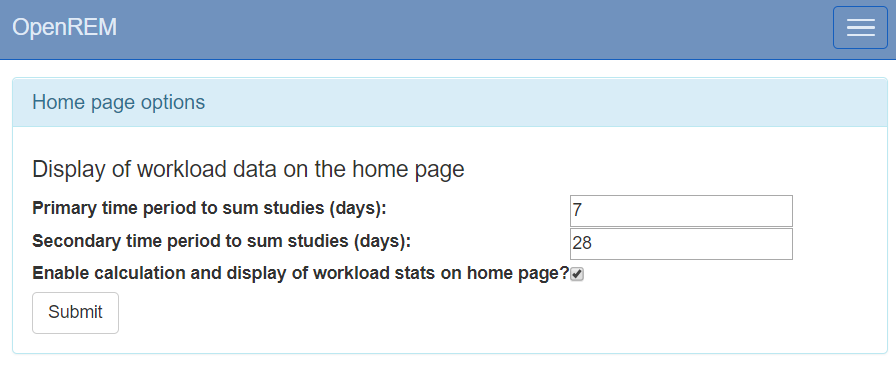

Home page options
*****************
*New in 0.8.2*

.. contents::

Display of workload information
===============================

.. figure:: img/ConfigMenu.png
   :figwidth: 30%
   :align: right
   :alt: Config options

   Figure 1: The ``Config`` menu (user and admin)

The home page can be configured to show the number of studies carried out in
the past 7 (default) and 28 (default) days for each system. These default
values can be changed by logging in, clicking on the ``Config`` menu at the
right-hand end of the navigation bar, and then selecting the ``Home page
options`` entry under ``User level config`` shown in the upper section of
figure 1. This takes the user to a page where the two time periods can be
viewed and updated (figure 2).

.. figure:: img/homePageOptions.png
   :figwidth: 100%
   :align: center
   :alt: The home page options form

   Figure 2: The home page options form

By default the display of workload information is disabled; this can be changed
by an OpenREM administrator via the ``Home page options``. When an OpenREM
administrator views the home page options a tick box is included that enables or
disables the display of workload data on the home page (figure 3).

   Figure 3: The home page options admin form
