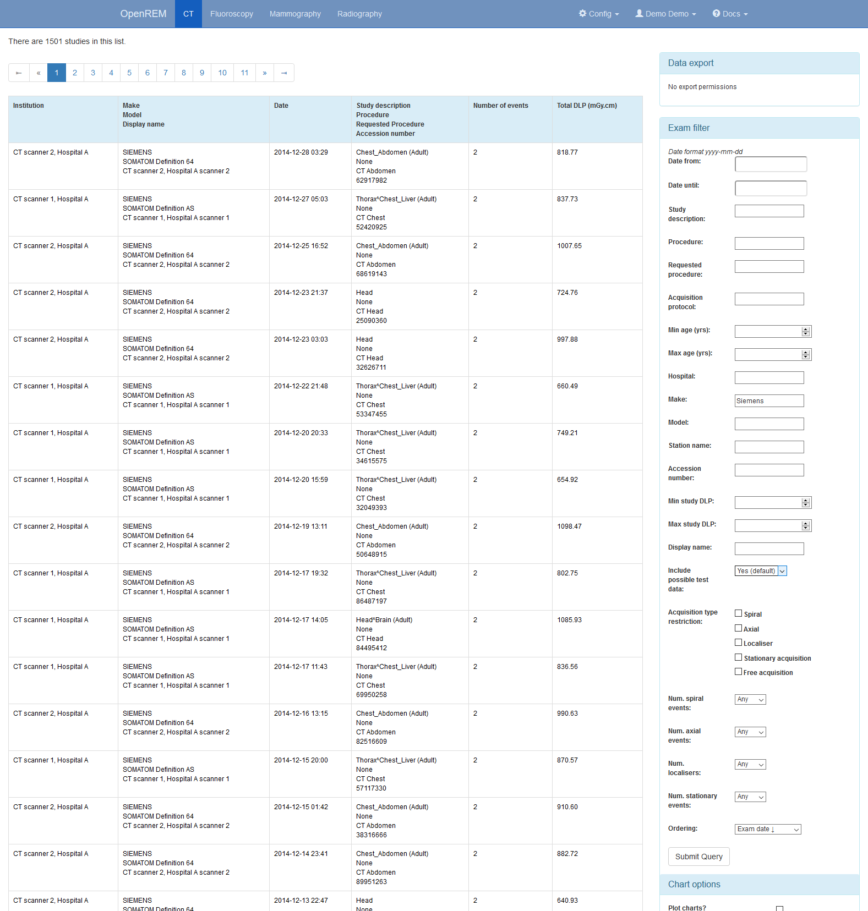
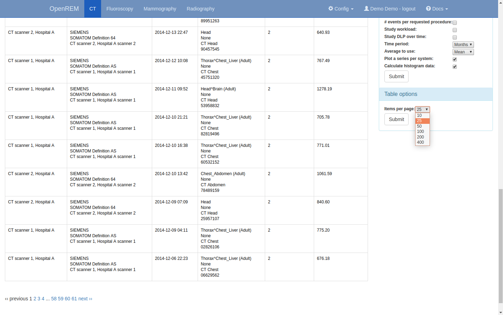

Navigating, filtering and study details
***************************************

Navigating the OpenREM web interface
====================================

Depending on your web server setup, your web interface to OpenREM will
usually be at http://yourserver/openrem or if you are using the test web
server then it might be at http://localhost:8000/openrem.

The home page for OpenREM should look something like this when it is
populated with studies:

   OpenREM homepage screenshot

By selecting the links in the navigation bar at the top, you can view all
of the CT, fluoroscopy, mammography or radiographic studies. Alternatively, click on any row to filter by that system.

The modality tables can be sorted by any of the columns by clicking on the
column header that you wish to sort by.

If you are not logged in, clicking any of the links will bring up the log in page.

Filtering for specific studies
==============================

This image shows the CT studies view, available to any logged in user, filtered by entering terms in the
boxes on the right hand side to show just the studies where the modality
model name includes the term 'soma':

   Filtering CT studies

The search fields can all be used on their own or together, and they are
all case insensitive 'contains' searches. The exception is the date field,
where both from and to have to be filled in (if either are), and the format
must be ``yyyy-mm-dd``. There currently isn't any more complex filtering
available, but it does exist as `issue 17 <https://bitbucket.org/openrem/openrem/issue/17/>`_
for a future release.

The last box below the filtering search boxes is the ordering preference.

A note on filtering CT studies by acquisition type
--------------------------------------------------

The CT study filters includes the ability to restrict the displayed studies
by acquisition type, such as ``Spiral`` or ``Axial``. By default none of these
are selected, and studies containing all acquisition types are shown. Ticking
one of the acquisition type restrictions and clicking submit will filter the
displayed studies to only include those which have at least one acquisition of
the selected type. Ticking more than one acquisition type restriction will show
studies that contain at least one acquisition of any of the selected
acquisition types.

Acquisition-level charts will only show acquisition protocols that correspond
to the chosen acquisition type restrictions. Acquisitions of any other type
present within the study data will not be shown on these charts.

Study- and request-level charts will show studies that have at least one
acquisition of a type matching the selected restrictions: these studies and
requests may contain acquisition types other than those chosen in the
restrictions.

For example, if all studies contain a mixture of ``Axial`` and ``Spiral``
acquisitions and the user ticks the ``Axial`` acquisition type restriction then
all studies will still be displayed in the filtered list. However, any
acquisition-level charts will only show ``Axial`` acquisitions: the ``Spiral``
acquisitions present in the studies will not be shown in the chart. Any study-
or request-level chart will show all the data as every one of them includes
at least one ``Axial`` acquisition.

Setting the number of studies displayed per page
================================================

The number of studies displayed per page can be controlled by changing the
value selected in the ``Items per page`` drop down box, located beneath the
chart options:

   Setting the number of studies per page

Viewing study details
=====================

By clicking on the study description link (in blue), you can see more
details for an individual study:

   Individual CT study

Not all the details stored for any one study are displayed, just those thought
to be most useful. If there are others you'd like to see, add an issue to the tracker.

The final field in the summary at the top is called 'Test patient indicators?'
When studies are imported the ID and patient name fields are both ignored, but they
are parsed to check if they have 'phy', 'test' or 'qa' in them to help exclude them
from the data analysis. If they do, then this information is added to the
field and is displayed both in the web interface as a Test patient indicator
and in the Excel export. The name and ID themselves are not reproduced,
simply the presence of one of the key words. Therefore a patient named
'Phyliss' would trigger this, but only 'Phy' would be reproduced in this field.
Other fields will also help to confirm whether a study is for a real patient
such as the lack of an Accession Number and an unusual patient age.

A note on time data for fluoroscopy studies
-------------------------------------------

On the page showing a specific fluoroscopy study there is a table that shows the
details of each irradiation event in the study. This table includes a column
labelled as::

    Duration (ms)
    Exposure time (ms)

The ``Duration`` value is the amount of time that the exposure switch or pedal was
pressed (technically, this should be the time from the loading of the first x-ray
pulse to the time of the trailing edge of the final pulse for that irradiation
event). The ``Exposure time`` value is different: this is the total time that the
x-ray beam was actually switched on for during the irradiation event. So for
pulsed fluoroscopy the ``Exposure time`` will be (much) shorter than the
``Duration``.

Near the top of each fluoroscopy study in the detail view is a table summarising the
DAP, dose at reference point and duration for each irradiation type used in the study.
Totals are also shown. The ``Total duration`` values in this table show the amount
of time that the exposure switch or pedal was pressed.
