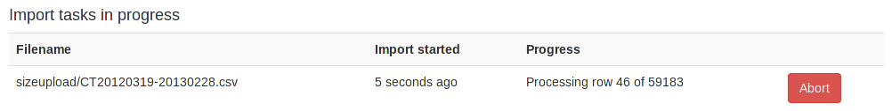

Adding patient size information from csv using the web interface
****************************************************************
*New in 0.4.3*

Uploading patient size data
===========================

If you log in as a user that is in the ``admingroup``, then a menu is
available at the right hand end of the navigation bar:

The first option takes you to a page where you can upload a csv file
containing details of the patient height and weight, plus either the
accession number or the Study Instance UID.

.. image:: img/AdminUploadPtSzCSV.png
    :align: center
    :alt: Uploading CSV files containing patient size information

.. image:: img/AdminUploadButton.png
    :align: right
    :alt: Upload patient size csv file button

The csv file needs to have at least the required columns. Additional columns
will be ignored. If your source of patient size data does not have either the
height or the weight column, simply add a new empty column with just the title
in the first row.

When you have selected the csv file, press the button to upload it.

Importing the size data to the database
=======================================

On the next page select the column header that corresponds to each of the 
head, weight and ID fields. Also select whether the ID field is an Accession number
or a Study UID:

When the column headers are selected, click the 'Process the data' button.

.. image:: img/AdminSizeHeaders.png
    :align: center
    :alt: Selecting header information

The progress of the import is then reported on the patient size imports page:

As soon as the import is complete, the source csv file is deleted from the
server.

Reviewing previous imports
==========================

After an import is complete, it is listed in the completed import tasks
table. You can also get to this page from the Admin menu:

For each import, there is a link to the logfile, which looks something like this.
With this import accession numbers weren't available so the patient size
information was matched to the study instance UID:

Deleting import logs
====================

The completed import tasks table also has a delete check box against each
record and a delete button at the bottom. The csv file originally imported
has already been deleted - this delete function is to remove the record
of the import and the log file associated with it from the database/disk.
