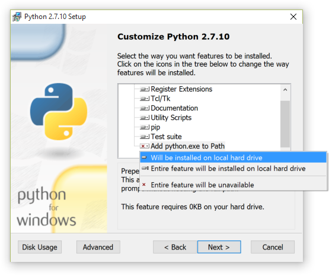

*****************************
Pre-installation preparations
*****************************

Install Python 2.7.x and pip
============================

* Linux – likely to be installed already
* Windows – instructions and downloads are available at `python.org <https://www.python.org/downloads>`_

Add Python and the scripts folder to the path
---------------------------------------------
*Windows only – this is usually automatic in linux*

During the Windows Python 2.7 installation, 'install' Add Python.exe to Path:

    Python installation customisation dialogue

If Python is already installed, you can add Python to Path yourself:

    Add the following to the end of the ``path`` environment variable (to see
    how to edit the environment variables, see http://www.computerhope.com/issues/ch000549.htm)::

        ;C:\Python27\;C:\Python27\Scripts\

Setuptools and pip
------------------

Install setuptools and pip – for details go to
http://www.pip-installer.org/en/latest/installing.html. The quick version
is as follows:

Linux

    Download the latest version using the same method as for Windows, or
    get the version in your package manager, for example::

        sudo apt-get install python-pip

Windows

    Pip is normally installed with Python. If it hasn't been, download the installer script
    `get-pip.py <https://bootstrap.pypa.io/get-pip.py>`_
    and save it locally – right click and *Save link as...* or equivalent.

    Open a command window (Start menu, cmd.exe) and navigate to the place
    you saved the get‑pip.py file::

        python get-pip.py

Quick check of python and pip
^^^^^^^^^^^^^^^^^^^^^^^^^^^^^

To check everything is installed correctly so far, type the following in a 
command window/shell. You should have the version number of pip returned to 
you::

    pip -V

Install RabbitMQ
================

* Linux - Follow the guide at http://www.rabbitmq.com/install-debian.html
* Windows - Follow the guide at http://www.rabbitmq.com/install-windows.html

For either install, just follow the defaults – no special configurations required.
Please note that RabbitMQ requires that Erlang is installed first, as described in
the above links.

..  Note::

    If you encounter problems running RabbitMQ as a service under Windows then try the following:

    * Create a folder called ``c:\rabbitmq``
    * From an administrator command prompt run Advanced System Properties by typing ``sysdm.cpl``
    * Create a new system environment variable called ``RABBITMQ_BASE`` and set its value to ``c:\rabbitmq``
    * In the command prompt navigate to the folder containing the RabbitMQ commands and run::

        rabbitmq_service.bat remove
        rabbitmq_service.bat install
        rabbitmq_service.bat start

..  Note::

    Before continuing, `consider virtualenv`_

Install NumPy
=============

Numpy is required for charts.

For linux::

    sudo apt-get install python-numpy
    # If using a virtualenv, you might need to also do:
    pip install numpy

For Windows:

Download NumPy from http://www.lfd.uci.edu/~gohlke/pythonlibs/#numpy

* Find the right version - look for **numpy-X+mkl-cp27-cp27m-win32.whl** for 32-bit Windows or
* **numpy-X+mkl-cp27-cp27m-win_amd64.whl** for 64-bit Windows.
* At the time of writing, ``X`` was ``1.14.0`` - choose the latest version
* Install using pip:

.. sourcecode:: console

    pip install C:\path\to\numpy‑1.14.0+mkl‑cp27-cp27m‑win32.whl  # update the version number
    # or
    pip install C:\path\to\numpy‑1.14.0+mkl‑cp27‑cp27m‑win_amd64.whl  # update the version number
    # changing the path and filename to the numpy appropriately

.. _installpreppostgres:

Install PostgreSQL database
===========================

For production use, you will need to install and configure a database. We strongly recommend PostgreSQL, but you can
use any of the databases listed on the `Django website <https://docs.djangoproject.com/en/1.8/ref/databases/>`_ such
as MySQL, Oracle or MS SQL Server, with the limitations listed there. There is one additional limitation - the
calculation of median values for charts in OpenREM is dependent on using PostgreSQL.

If this is your first time installing OpenREM and you just want to test it out, you *can* skip this step and make use
of the in-built SQLite database. However, you should expect to start again when you move to a production grade database.

* :doc:`postgresql`
* :doc:`postgresql_windows`

.. _installdicomstore:

Install a DICOM Store service
=============================

To have modalities send DICOM objects to your OpenREM server, or to use query-retrieve from a PACS, you need to install
a DICOM Store service. For testing, you can make use of the DICOM Store OpenREM can provide. However, because this is not
stable over longer periods of time we recommend using a third-party DICOM Store service. You can use any one you like,
as long as it can be scripted to call OpenREM scripts when DICOM objects are received. We recommend Orthanc or Conquest
for this and provide details of how to configure them in the :ref:`configure_third_party_DICOM` section.

Orthanc
-------
* Ubuntu users: ``sudo apt install orthanc``
* Windows users: Download from https://www.orthanc-server.com/download-windows.php after filling in the form
* Configuration instructions can be found in the :ref:`configure_third_party_DICOM` section.

Alternative - Conquest
----------------------
* Download Conquest DICOM server from https://ingenium.home.xs4all.nl/dicom.html
* Install using the instructions included in the download - there is a PDF with Windows install instructions and general
  usage instructions, and another PDF with Linux install instructions. The guides in :ref:`configure_third_party_DICOM`
  should be consulted when making configuration decisions.
* Alternatively, Ubuntu 16.04 users can use the following instructions:

  ..  toctree::
      :maxdepth: 1

      conquestUbuntu

Unlike with the database, it is possible to change DICOM Store service at a later point.

.. _install_toshiba_resources:

Resources for creating RDSR for older Toshiba CT scanners
=========================================================

*New in version 0.8.0*

If you need to import data from older Toshiba CT scanners into OpenREM then the following tools need to be available
on the same server as OpenREM:

    * The `Offis DICOM toolkit`_
    * `Java`_
    * pixelmed.jar from the `PixelMed Java DICOM Toolkit`_

For more information see :ref:`toshiba_legacy_imports`. The locations of these executables needs to be configured in the
``local_settings.py`` - see :ref:`toshiba_configuration`.

Install OpenREM
===============

You are now ready to install OpenREM, so go to the :doc:`install` docs.

Further instructions
====================

Virtualenv and virtualenvwrapper
--------------------------------

If the server is to be used for more than one python application, or you
wish to be able to test different versions of OpenREM or do any development,
it is highly recommended that you use `virtualenv`_ or maybe `virtualenvwrapper`_

Virtualenv sets up an isolated python environment and is relatively easy to use.

If you do use virtualenv, all the paths referred to in the documentation will
be changed to:

* Linux: ``vitualenvfolder/lib/python2.7/site-packages/openrem/``
* Windows: ``virtualenvfolder\Lib\site-packages\openrem``

In Windows, even when the virtualenv is activated you will need to call `python`
and provide the full path to script in the `Scripts` folder. If you call the
script (such as `openrem_rdsr.py`) without prefixing it with `python`, the
system wide Python will be used instead. This doesn't apply to Linux, where
once activated, the scripts can be called without a `python` prefix from anywhere.

Quickstart Ubuntu install using virtualenv
==========================================

If you want to get everything installed quickly, you could do the following on a Ubuntu server::

    dose@ubuntu1604:~$ sudo apt update
    dose@ubuntu1604:~$ sudo apt install python python-pip rabbitmq-server postgresql libpq-dev orthanc dcmtk default-jre
    dose@ubuntu1604:~$ pip install virtualenv
    dose@ubuntu1604:~$ virtualenv veopenrem
    dose@ubuntu1604:~$ . veopenrem/bin/activate
    (veopenrem) dose@ubuntu1604:~$ pip install numpy psycopg2

You will then need to setup the :doc:`postgresql` and download the latest version of the pixelmed.jar application
e.g.::

    (veopenrem) dose@ubuntu1604:~$ wget http://www.dclunie.com/pixelmed/software/20180419_current/pixelmed.jar

We can now install OpenREM and a customised version of pynetdicom::

    (veopenrem) dose@ubuntu1604:~$ pip install openrem
    (veopenrem) dose@ubuntu1604:~$ pip install https://bitbucket.org/edmcdonagh/pynetdicom/get/default.tar.gz#egg=pynetdicom-0.8.2b2

You can now go straight to the :ref:`localsettingsconfig`.

.. _virtualenv: https://virtualenv.pypa.io/
.. _virtualenvwrapper: http://virtualenvwrapper.readthedocs.org/en/latest/
.. _consider virtualenv: `Virtualenv and virtualenvwrapper`_
.. _`Offis DICOM toolkit`: http://dicom.offis.de/dcmtk.php.en
.. _`Java`: http://java.com/en/download/
.. _`PixelMed Java DICOM Toolkit`: http://www.pixelmed.com/dicomtoolkit.html
