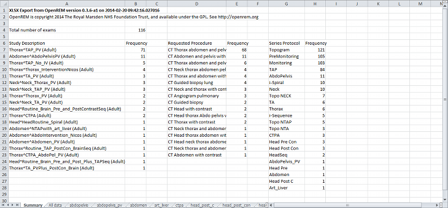

Exporting study information
***************************

Exporting to csv and xlsx sheets
================================

If you are logged in as a user in the ``exportgroup`` or the ``admingroup``,
the csv export links will be available near the top of the modality filter pages
in the OpenREM interface. In the CT interface, you can also export to an 
enhanced XLSX spreadsheet. 

For CT, the XLSX export has multiple sheets. The first sheet contains a 
summary of all the study descriptions, requested procedures and series
protocol names contained in the export:

    
This information is useful for seeing what data is in the spreadsheet, and
can also be used to prioritise which studies or protocols to analyse based on
frequency.

The second sheet of the exported file lists all the studies, with each study
taking one line and each series in the study displayed in the columns to the right.

.. image:: img/CTExportAllData.png
    :width: 730px
    :align: center
    :height: 339px
    :alt: CT export all data sheet

The remainder of the file has one sheet per series protocol name. Each series
is listed one per line. If a single study
has more than one series with the same protocol name, then the same study
will appear on more than one line.
