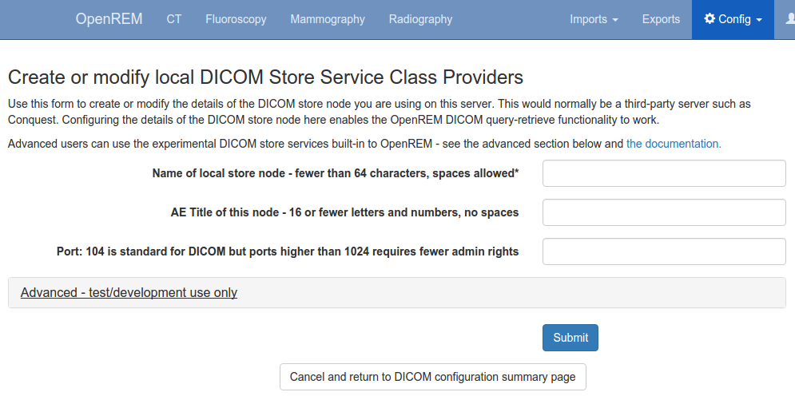
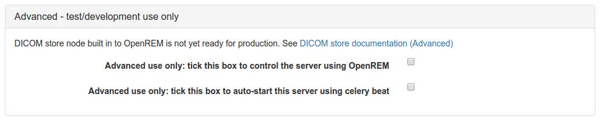
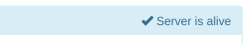
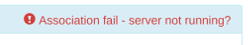

###########################
DICOM Network Configuration
###########################

****************************************
Configuring DICOM store nodes in OpenREM
****************************************

You need to configure one or more DICOM Store nodes (Store Service Class Provider, or Store SCP) if you want either of
the following:

* OpenREM to provide DICOM store functionality
* OpenREM to be able to query retrieve a third-party system (PACS or modality), using the OpenREM Store SCP or a third
  party one, such as Conquest

To configure a DICOM Store SCP, on the ``Config`` menu select ``DICOM networking``, then click
``Add new Store`` and fill in the details (see figure 1):

   Figure 1: DICOM Store SCP configuration

* Name of local store node: This is the *friendly name*, such as ``OpenREM store``
* Application Entity Title of the node: This is the DICOM name for the store, and must be letters or numbers only, no
  spaces, and a maximum of 16 characters
* Port for store node: Port 104 is the reserved DICOM port, but it is common to use *high* ports such as 8104, partly
  because ports up to 1024 usually need more privileges than for the high ports. However, if there is a firewall
  between the remote nodes (modalities, PACS) and the OpenREM server, then you need to make sure that the firewall is
  configured to allow the port you choose here

.. _nativestore:

******************************************
Native DICOM store node with direct import
******************************************

.. Warning::

    Native DICOM store functionality has not proved to be stable over long periods. Therefore we cannot recommend that
    you use this feature in a production environment. However, please do test it and help us to improve it if you are
    able to!

.. Warning::

    If you use supervisord or similar on Linux, then you might not be able to use the web interface or possibly the
    auto-start service as new threads spawned for the Store SCP tend to get killed. This wouldn't prevent you starting
    the SCP in a shell. See `Issue #337`_

An OpenREM DICOM Store SCP (service class provider) enables modalities or PACS to send DICOM structured reports and
images directly to OpenREM where they are imported into the database.

The Store SCP service receives the data, checks whether it is one of the objects that OpenREM can extract data from,
and starts an import task if applicable.

The object is then left in the ``dicom_in`` folder in the ``media`` folder, or it is deleted, depending on the policy
set in :doc:`i_deletesettings`.

For native DICOM store nodes, you need to open the ``Advanced - test/development use only`` section (see figure 2):

   Figure 2: DICOM Store SCP advanced configuration

* Control the server using OpenREM: this checkbox will enable OpenREM to create and control the node
* Auto-start the server using celery beat: if checked, and if :ref:`celery-beat` is running, then OpenREM will attempt
  to start the store node whenever it finds it not to be running.

Third-party DICOM store node for scripted import to OpenREM
===========================================================

If you are using Conquest or another third-party Store SCP to collect DICOM data, simply fill in the basic details as
above without configuring the settings in the ``Advanced`` section. This will enable you to request remote hosts send
data to your Store SCP in the *retrieve* part of the query-retrieve operation.

See :doc:`conquestUbuntu` and :doc:`conquestAsWindowsService` for more information about using Conquest with OpenREM

*******************************
Status of DICOM Store SCP nodes
*******************************

DICOM Store SCP advanced configuration

   Figure 3: DICOM Store SCP status - Alive and Association failed

DICOM Store SCP nodes that have been configured are listed in the left column of the DICOM network configuration page.
For each server, the basic details are displayed, including the Database ID which is required for command line/scripted
use of the query-retrieve function.

In the title row of the Store SCP config panel, the status will be reported either as 'Server is alive' or 'Error:
Association fail - server not running?' - see figure 3

Controlling native Store SCP nodes
==================================

If a native Store SCP node is not running, then a ``Start server`` button will be presented at the bottom right. If it
is running, this buttin will change to ``Stop server``, and the ``Delete`` button will become inactive.

If the node is configured to be auto-started, and if :ref:`celery-beat` is running, then each minute if the server is
not started Celery will try to start the node. If you intend to stop the node for some reason, modify the configuration
so that auto-start is not selected, then stop the server.

****************************************************************
Query retrieve of third-party system, such as a PACS or modality
****************************************************************

To Query-Retrieve a remote host, you will need to configure both a local Store SCP and the remote host.

To configure a remote query retrieve SCP, on the ``Config`` menu select ``DICOM networking``, then click
``Add new QR Node`` and fill in the details:

* Name of QR node: This is the *friendly name*, such as ``PACS QR``
* AE Title of the remote node: This is the DICOM name of the remote node, 16 or fewer letters and numbers, no spaces
* AE Title this server: This is the DICOM name that the query (DICOM C-Find) will come from. This may be important if
  the remote node filters access based on *calling aet*. Normal rules of 16 or fewer letters and numbers, no spaces
* Remote port: Enter the port the remote node is using (eg 104)
* Remote IP address: The IP address of the remote node, for example ``192.168.1.100``
* Remote hostname: Alternatively, if your network has a DNS server that can resolve the hostnames, you can enter the
  hostname instead. If the hostname is entered, it will be used in preference to the IP address, so only enter it if
  you know it will be resolved.

Now go to the :doc:`netdicom-qr` documentation to learn how to use it.

.. _storetroubleshooting:

**********************************
Troubleshooting: openrem_store.log
**********************************

If the default logging settings haven't been changed then there will be a log files to refer to. The default
location is within your ``MEDIAROOT`` folder:

This file contains information about each echo and association that is made against the store node, and any objects that
are sent to it.

The following is an example of the log for a Philips *dose info* image being received:

.. sourcecode:: console

    [21/Feb/2016 21:13:43] INFO [remapp.netdicom.storescp:310] Starting AE... AET:MYSTOREAE01, port:8104
    [21/Feb/2016 21:13:43] INFO [remapp.netdicom.storescp:314] Started AE... AET:MYSTOREAE01, port:8104
    [21/Feb/2016 21:13:43] INFO [remapp.netdicom.storescp:46] Store SCP: association requested
    [21/Feb/2016 21:13:44] INFO [remapp.netdicom.storescp:54] Store SCP: Echo received
    [21/Feb/2016 21:13:46] INFO [remapp.netdicom.storescp:46] Store SCP: association requested
    [21/Feb/2016 21:13:46] INFO [remapp.netdicom.storescp:54] Store SCP: Echo received
    [21/Feb/2016 21:13:49] INFO [remapp.netdicom.storescp:46] Store SCP: association requested
    [21/Feb/2016 21:13:49] INFO [remapp.netdicom.storescp:54] Store SCP: Echo received
    [21/Feb/2016 21:13:50] INFO [remapp.netdicom.storescp:46] Store SCP: association requested
    [21/Feb/2016 21:13:50] INFO [remapp.netdicom.storescp:54] Store SCP: Echo received
    [21/Feb/2016 21:13:51] INFO [remapp.netdicom.storescp:46] Store SCP: association requested
    [21/Feb/2016 21:13:51] INFO [remapp.netdicom.storescp:54] Store SCP: Echo received
    [21/Feb/2016 21:14:39] INFO [remapp.netdicom.storescp:46] Store SCP: association requested
    [21/Feb/2016 21:14:39] INFO [remapp.netdicom.storescp:78] Received C-Store. Stn name NM-54316, Modality CT,
    SOPClassUID Secondary Capture Image Storage, Study UID 1.2.840.113564.9.1.2843752344.47.2.5000947881 and Instance
    UID 1.2.840.113704.7.1.1.4188.1234134540.349
    [21/Feb/2016 21:14:39] INFO [remapp.netdicom.storescp:232] File
    /var/openrem/media/dicom_in/1.2.840.113704.7.1.1.4188.1453134540.349.dcm written
    [21/Feb/2016 21:14:39] INFO [remapp.netdicom.storescp:263] Processing as Philips Dose Info series
    ...etc

.. _`Issue #337`: https://bitbucket.org/openrem/openrem/issues/337/storescp-is-killed-if-daemonized-when