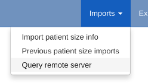
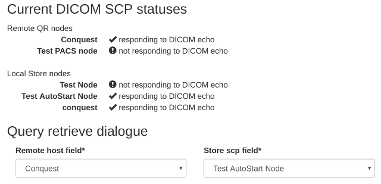

############################
DICOM Query Retrieve Service
############################

To query retrieve dose related objects from a remote server, you need to review the :doc:`netdicom-store` documents
first to make sure you have created a DICOM Store node which will import objects to OpenREM.

You will also need to set up the remote server to allow you to query-retrieve using it - the remote server will need
to be configured with details of the store node that you have configured.

**************************************
Query-retrieve using the web interface
**************************************

   Figure 1: Import Query-Retrieve menu

* On the Imports menu, select ``Query remote server`` - see figure 1. If the menu isn't there, you need to check your
  user permissions -- see :ref:`user-settings` for details.
* Each configured query-retrieve node and each local store node is automatically tested to make sure they respond to a
  DICOM echo - the results are presented at the top of the page. See figure 2 for an example.

   Figure 2: Local and remote QR statuses

* Select the desired **remote host**, ie the PACS or modality you wish to query.
* Select the local **store node** you want to retrieve to.
* Select **which modalities** you want to query for - at least one must be ticked.
* Select a **date range** - the wider this is, the more stress the query will place on the remote server, and the higher
  the likelyhood of the query being returned with zero results (a common configuration on the remote host to prevent
  large database queries affecting other services). Defaults to 'from yesterday'.
* If you wish to **exclude studies** based on their study description, enter the text here. Add several terms by separating
  them with a comma. One example would be to exclude any studies with ``imported`` in the study description, if
  your institution modifies this field on import. The matching is case-insensitive.
* Alternatively, you might want to only **keep studies** with particular terms in the study description. If so, enter them
  in the next box, comma separated.
* You can also **exclude studies by station name**, or only keep them if they match the station name. This is only
  effective if the remote system (the PACS) supports sending back station name information.

Advanced query options
======================

* **Attempt to get Toshiba dose images** *default not ticked*: If you have done the extra installation and configuration
  required for creating RDSRs from older Toshiba scanners, then you can tick this box for `CT` searches to get the
  images needed for this process. See the logic description below for details.
* **Ignore studies already in the database** *default ticked*: By default OpenREM will attempt to avoid downloading any
  DICOM objects (RDSRs or images) that have already been imported into the database. Untick this box to override that
  behaviour and download all suitable objects. See the logic description below for details.
* **Include SR only studies** *default not ticked*: If you have a DICOM store with only the radiation dose structured
  reports (RDSR) in, or a mix of whole studies and RDSRs without the corresponding study, then tick this box. Any
  studies with images and RDSRS will be ignored (they can be found without this option). If this box is ticked any
  modality choices will be ignored.
* **Get SR series that return nothing at image level query** *default not ticked*: If you have a DICOM store with SR
  series that you know contain RDSR objects, but when queried your store says they are empty, then check this box. If
  this behaviour is found, a message will be added to the ``openrem_qr.log`` at ``INFO`` level with the phrase
  ``Try '-emptysr' option?``. With the box checked the query will assume any SR series found contains an RDSR. Warning:
  with this behavior, any non-RDSR structured report series (such as a radiologists report encoded as a structured
  report) will be retrieved instead of images that could actually be used (for example with mammography and digital
  radiographs). Therefore this option should be used with caution!

When you have finished the query parameters, click ``Submit``

Review and retrieve
===================

The progress of the query is reported on the right hand side. If nothing happens, ask the administrator to check if the
celery queue is running.

Once all the responses have been purged of unwanted modalities, study descriptions or study UIDs, the number of studies
of each type will be displayed and a button appears. Click ``Retrieve`` to request the remote server send the selected
objects to your selected Store node. This will be based on your original selection - changing the node on the left hand
side at this stage will have no effect.

The progress of the retrieve is displayed in the same place until the retrieve is complete.

.. _qrcommandlineinterface:

***********************************************
Query-retrieve using the command line interface
***********************************************

In a command window/shell, ``python openrem_qr.py -h`` should present you with the following output:

.. sourcecode:: console

    usage: openrem_qr.py [-h] [-ct] [-mg] [-fl] [-dx] [-f yyyy-mm-dd]
                         [-t yyyy-mm-dd] [-sd yyyy-mm-dd] [-tf hhmm] [-tt hhmm]
                         [-e string] [-i string] [-sne string] [-sni string]
                         [-toshiba] [-sr] [-dup] [-emptysr]
                         qr_id store_id

    Query remote server and retrieve to OpenREM

    positional arguments:
      qr_id                 Database ID of the remote QR node
      store_id              Database ID of the local store node

    optional arguments:
      -h, --help            show this help message and exit
      -ct                   Query for CT studies. Cannot be used with -sr
      -mg                   Query for mammography studies. Cannot be used with -sr
      -fl                   Query for fluoroscopy studies. Cannot be used with -sr
      -dx                   Query for planar X-ray studies. Cannot be used with -sr
      -f yyyy-mm-dd, --dfrom yyyy-mm-dd
                            Date from, format yyyy-mm-dd. Cannot be used with --single_date
      -t yyyy-mm-dd, --duntil yyyy-mm-dd
                            Date until, format yyyy-mm-dd. Cannot be used with --single_date
      -sd yyyy-mm-dd, --single_date yyyy-mm-dd
                            Date, format yyy-mm-dd. Cannot be used with --dfrom or --duntil
      -tf hhmm, --tfrom hhmm
                            Time from, format hhmm. Requires --single_date.
      -tt hhmm, --tuntil hhmm
                            Time until, format hhmm. Requires --single_date.
      -e string, --desc_exclude string
                            Terms to exclude in study description, comma separated, quote whole
                            string
      -i string, --desc_include string
                            Terms that must be included in study description, comma separated,
                            quote whole string
      -sne string, --stationname_exclude string
                            Terms to exclude in station name, comma separated, quote whole string
      -sni string, --stationname_include string
                            Terms to include in station name, comma separated, quote whole string
      -toshiba              Advanced: Attempt to retrieve CT dose summary objects and one image
                            from each series
      -sr                   Advanced: Use if store has RDSRs only, no images. Cannot be used with
                            -ct, -mg, -fl, -dx
      -dup                  Advanced: Retrieve duplicates (objects that have been processed before)
      -emptysr              Advanced: Get SR series that return nothing at image level query

As an example, if you wanted to query the PACS for DX images on the 5th and 6th April 2010 with any study descriptions
including ``imported`` excluded, first you need to know the database IDs of the remote node and the local node you want
the images sent to. To find these, go to the :doc:`netdicom-nodes` page where the database ID is listed among the other
details for each node.

Assuming the PACS database ID is 2, and the store node ID is 1, the command would look something like:

.. sourcecode:: console

    python openrem_qr.py 2 1 -dx -f 2010-04-05 -t 2010-04-06 -e "imported"

If you want to do this regularly to catch new studies, you might like to use a script something like this on linux:

.. sourcecode:: bash

    #!/bin/bash

    . /var/dose/veopenrem/bin/activate  # activate virtualenv if you are using one, modify or delete this line

    ONEHOURAGO=$(date -d "1 hour ago" "+%Y-%m-%d")

    python openrem_qr.py 2 1 -dx -f $ONEHOURAGO -t $ONEHOURAGO  -e "Imported"

This script could be run once an hour using a cron job. By asking for the date an hour ago, you shouldn't miss exams
taking place in the last hour of the day.

A similar script could be created as a batch file or PowerShell script on Windows and run using the scheduler. An
example PowerShell script is shown below:

.. sourcecode:: powershell

    # Script to obtain all CT studies from a DICOM node on the day prior to the
    # date the script is run and import them into OpenREM.
    # Get yesterday's date
    $dateString = "{0:yyyy-MM-dd}" -f (get-date).AddDays(-1)
    # Run the openrem_qr.py script with yesterday's date as the to and from date
    python D:\Server_Apps\python27\Scripts\openrem_qr.py 2 1 -ct -f $dateString -t $dateString

The above PowerShell script could be run on a regular basis by adding a task to the Windows ``Task Scheduler`` that
executes the ``powershell`` program with an argument of ``-file C:\path\to\script.ps1``.

Querying with time range
========================

*New to OpenREM 0.9.0*

It is now possible to query for studies in a time window when using query-retrieve from the command line (web interface
version will be introduced later). This can be particularly useful where PACS query responses are limited or null if the
query matches too many studies.

Using the ``--tfrom``/``-tf`` and/or the ``--tuntil``/``-tt`` arguments are only allowed if ``--single_date``/``-sd``
argument is used.

Note: ``-sd 2018-03-19`` is the same as using ``-f 2018-03-19 -t 2018-03-19``, and can be used without the time
arguments.

* ``-tf`` used without ``-tt`` will search from ``tf`` until 23.59 that day.
* ``-tt`` used without ``-tf`` will search from 00.00 to ``tt`` that day.
* ``-tf`` and ``-tt`` used together will search from ``tf`` to ``tt``.

For example, to search for CT from 12 noon to 3pm on 19th March 2018, using remote QR node database ID 2 and local store
database ID 1:

.. sourcecode:: bash

    python openrem_qr.py 2 1 -ct -sd 2018-03-19 -tf 1200 -tt 1500

*********************
Query filtering logic
*********************

Study level query response processing
=====================================

* First we query for each modality chosen in turn to get matching responses at study level.
* If the optional ``ModalitiesInStudy`` has been populated in the response, and if you have ticked
  ``Include SR only studies``, then any studies with anything other than just ``SR`` studies is removed from the
  response list.
* If any study description or station name filters have been added, and if the ``StudyDescription`` and/or
  ``StationName`` tags are returned by the remote server, the study response list is filtered accordingly.
* For the remaining study level responses, each series is queried.
* If ``ModalitiesInStudy`` was not returned, it is now built from the series level responses.
* If the remote server returned everything rather than just the modalities we asked for, the study level responses are
  now filtered against the modalities selected.

Series level query processing
=============================

* Another attempt is made to exclude or only-include if station name filters have been set

If **mammography** exams were requested, and a study has ``MG`` in:

* If one of the series is of type ``SR``, an image level query is done to see if it is an RDSR. If it is, all the
  other series responses are deleted (i.e. when the move request/'retrieve' is sent only the RDSR is requested
  not the images.
* Otherwise the ``SR`` series responses are deleted and all the image series are requested.

If **planar radiographic** exams were requested, and a study has ``DX`` or ``CR`` in:

* Any ``SR`` series are checked at 'image' level to see if they are RDSRs. If they are, the other series level responses
  for that study are deleted.
* Otherwise the ``SR`` series responses are deleted and all the image series are requested.

If **fluoroscopy** exams were requested, and a study has ``RF`` or ``XA`` in:

* Any ``SR`` series are checked at 'image' level to see if they are RDSRs or ESRs (Enhanced Structured Reports - not
  currently used but will be in the future). Any other ``SR`` series responses are deleted.
* All non-``SR`` series responses are deleted.

If **CT** exams were requested, and a study has ``CT`` in:

* Any ``SR`` series are checked at 'image' level to see if they are RDSRs. If they are, all other SR and image series
  responses are deleted. Otherwise, if it has an ESR series, again all other SR and image series responses are deleted.
* If there are no RDSR or ESR series, the other series are checked to see if they are Philips 'Dose info' series. If
  there are, other series responses are deleted.
* If there are no RDSR, ESR or 'Dose info' series and the option to get Toshiba images has been selected, then an image
  level query is performed for the first image in each series. If the image is not a secondary capture, all but the
  first image are deleted from the image level responses and the image_level_move flag is set. If the image is a
  secondary capture, the whole series response is kept.
* If there are no RDSR or ESR, series descriptions aren't returned and the Toshiba option has been set, the image level
  query is performed as per the previous point. This process will keep the responses that might have Philips 'Dose info'
  series.
* If there are no RDSR, ESR, series descriptions aren't returned and the Toshiba option has not been set, each series
  with more than five images in is deleted from the series response list - the remaining ones might be Philips 'Dose
  info' series.

If **SR only studies** were requested:

* Each series response is checked at 'image' level to see which type of SR it is. If is not RDSR or ESR, the study
  response is deleted.

If **Get SR series that return nothing at image level query** were requested:

* It is assumed that any ``SR`` series that appears to be empty actually contains an RDSR, and the other series are
  dealt with as above for when an RDSR is found. If at the image level query the full data requested is returned, then
  the series will be processed the same whether this option is selected or not.

Duplicates processing
=====================

For each remaining study in the query response, the Study Instance UID is checked against the studies already in
the OpenREM database.

If there is a match and the series level modality is **SR** (from a CT, or RF etc):

* The image level response will have the SOP Instance UID - this is checked against the SOP Instance UIDs recorded
  with the matching study. If a match is found, the 'image' level response is deleted.

If there is a match and the series level modality is **MG**, **DX** or **CR**:

* An image level query is made which will populate the image level responses with SOP Instance UIDs
* Each image level response is then processed and the SOP Instance UID is checked against the SOP Instance UIDs
  recorded with the matching study. If a match is found, the 'image' level response is deleted.

Once each series level response is processed:

* If the series no longer has any image  level responses the series level response is deleted.
* If the study no longer has any series level responses the study level response is deleted.

.. _qrtroubleshooting:

*******************************
Troubleshooting: openrem_qr.log
*******************************

If the default logging settings haven't been changed then there will be a log files to refer to. The default
location is within your ``MEDIAROOT`` folder:

This file contains information about the query, the status of the remote node, the C-Find response, the
analysis of the response, and the individual C-Move requests.

The following is an example of the start of the log for the following query which is run once an hour (ie some
responses will already have been imported):

.. sourcecode:: console

    openrem_qr.py 2 1 -dx -f 2016-05-04 -t 2016-05-04 -e "imported"

.. sourcecode:: console

    [04/May/2016 11:30:02] INFO [remapp.netdicom.qrscu:580] qrscu script called
    [04/May/2016 11:30:02] INFO [remapp.netdicom.qrscu:595] Modalities are ['DX']
    [04/May/2016 11:30:02] INFO [remapp.netdicom.qrscu:601] Date from: 2016-05-04
    [04/May/2016 11:30:02] INFO [remapp.netdicom.qrscu:604] Date until: 2016-05-04
    [04/May/2016 11:30:02] INFO [remapp.netdicom.qrscu:610] Study description exclude terms are ['imported']
    [04/May/2016 11:30:03] INFO [remapp.netdicom.qrscu:267] Request association with Hospital PACS PACSAET01 (PACSEAT01 104 DICOM_QR_SCP)
    [04/May/2016 11:30:03] INFO [remapp.netdicom.qrscu:33] Association response received
    [04/May/2016 11:30:03] INFO [remapp.netdicom.qrscu:277] assoc is ... <Association(Thread-7208, started daemon 140538998306560)>
    [04/May/2016 11:30:03] INFO [remapp.netdicom.qrscu:280] DICOM Echo ...
    [04/May/2016 11:30:03] INFO [remapp.netdicom.qrscu:282] done with status Success
    [04/May/2016 11:30:03] INFO [remapp.netdicom.qrscu:284] DICOM FindSCU ...
    [04/May/2016 11:30:03] INFO [remapp.netdicom.qrscu:311] Currently querying for DX studies...
    [04/May/2016 11:30:03] INFO [remapp.netdicom.qrscu:33] Association response received
    [04/May/2016 11:30:04] INFO [remapp.netdicom.qrscu:33] Association response received
    [04/May/2016 11:30:04] INFO [remapp.netdicom.qrscu:33] Association response received
    [04/May/2016 11:30:04] INFO [remapp.netdicom.qrscu:33] Association response received
    [04/May/2016 11:30:05] INFO [remapp.netdicom.qrscu:33] Association response received
    [04/May/2016 11:30:05] INFO [remapp.netdicom.qrscu:311] Currently querying for CR studies...
    [04/May/2016 11:30:05] INFO [remapp.netdicom.qrscu:33] Association response received
    [04/May/2016 11:30:05] INFO [remapp.netdicom.qrscu:33] Association response received
    [04/May/2016 11:30:06] INFO [remapp.netdicom.qrscu:33] Association response received
    [04/May/2016 11:30:06] INFO [remapp.netdicom.qrscu:33] Association response received
    [04/May/2016 11:30:06] INFO [remapp.netdicom.qrscu:33] Association response received
    [04/May/2016 11:30:07] INFO [remapp.netdicom.qrscu:33] Association response received
    [04/May/2016 11:30:10] INFO [remapp.netdicom.qrscu:33] Association response received
    [04/May/2016 11:30:10] INFO [remapp.netdicom.qrscu:33] Association response received
    [04/May/2016 11:30:11] INFO [remapp.netdicom.qrscu:33] Association response received
    [04/May/2016 11:30:11] INFO [remapp.netdicom.qrscu:33] Association response received
    [04/May/2016 11:30:12] INFO [remapp.netdicom.qrscu:33] Association response received
    [04/May/2016 11:30:12] INFO [remapp.netdicom.qrscu:33] Association response received
    [04/May/2016 11:30:12] INFO [remapp.netdicom.qrscu:33] Association response received
    [04/May/2016 11:30:12] INFO [remapp.netdicom.qrscu:339] Checking to see if any of the 16 studies are already in the OpenREM database
    [04/May/2016 11:30:13] INFO [remapp.netdicom.qrscu:343] Now have 11 studies
    [04/May/2016 11:30:13] INFO [remapp.netdicom.qrscu:349] Deleting studies we didn't ask for
    [04/May/2016 11:30:13] INFO [remapp.netdicom.qrscu:358] mod is DX, mod_set is ["CR"]
    [04/May/2016 11:30:13] INFO [remapp.netdicom.qrscu:358] mod is CR, mod_set is ["CR"]
    [04/May/2016 11:30:13] INFO [remapp.netdicom.qrscu:358] mod is DX, mod_set is ["PR", "DX"]
    [04/May/2016 11:30:13] INFO [remapp.netdicom.qrscu:358] mod is CR, mod_set is ["PR", "DX"]
    [04/May/2016 11:30:13] INFO [remapp.netdicom.qrscu:358] mod is DX, mod_set is ["DX"]
    [04/May/2016 11:30:13] INFO [remapp.netdicom.qrscu:358] mod is CR, mod_set is ["DX"]
    [04/May/2016 11:30:13] INFO [remapp.netdicom.qrscu:358] mod is DX, mod_set is ["PR", "CR"]
    [04/May/2016 11:30:13] INFO [remapp.netdicom.qrscu:358] mod is CR, mod_set is ["PR", "CR"]
    [04/May/2016 11:30:13] INFO [remapp.netdicom.qrscu:367] Now have 11 studies
    [04/May/2016 11:30:13] INFO [remapp.netdicom.qrscu:372] Deleting series we can't use
    [04/May/2016 11:30:13] INFO [remapp.netdicom.qrscu:408] Now have 11 studies
    [04/May/2016 11:30:13] INFO [remapp.netdicom.qrscu:413] Deleting any studies that match the exclude criteria
    [04/May/2016 11:30:13] INFO [remapp.netdicom.qrscu:422] Now have 6 studies after deleting any containing any of [u'imported']
    [04/May/2016 11:30:13] INFO [remapp.netdicom.qrscu:438] Release association
    [04/May/2016 11:30:13] INFO [remapp.netdicom.qrscu:499] Preparing to start move request
    [04/May/2016 11:30:13] INFO [remapp.netdicom.qrscu:504] Requesting move of 6 studies
    [04/May/2016 11:30:13] INFO [remapp.netdicom.qrscu:509] Mv: study_no 1
    [04/May/2016 11:30:13] INFO [remapp.netdicom.qrscu:515] Mv: study no 1 series no 1
    [04/May/2016 11:30:13] INFO [remapp.netdicom.qrscu:528] Requesting move: modality DX, study 1 (of 6) series 1 (of 1). Series contains 1 objects
    [04/May/2016 11:30:13] INFO [remapp.netdicom.qrscu:33] Association response received
    [04/May/2016 11:30:13] INFO [remapp.netdicom.qrscu:44] Move association requested
    [04/May/2016 11:30:18] INFO [remapp.netdicom.qrscu:53] Move association released
    [04/May/2016 11:30:18] INFO [remapp.netdicom.qrscu:532] _move_req launched
    [04/May/2016 11:30:18] INFO [remapp.netdicom.qrscu:509] Mv: study_no 2
    [04/May/2016 11:30:18] INFO [remapp.netdicom.qrscu:515] Mv: study no 2 series no 1
    [04/May/2016 11:30:18] INFO [remapp.netdicom.qrscu:528] Requesting move: modality DX, study 2 (of 6) series 1 (of 1). Series contains 2 objects
    [04/May/2016 11:30:18] INFO [remapp.netdicom.qrscu:33] Association response received
    [04/May/2016 11:30:19] INFO [remapp.netdicom.qrscu:44] Move association requested
    [04/May/2016 11:30:29] INFO [remapp.netdicom.qrscu:48] gg is Pending
    [04/May/2016 11:30:30] INFO [remapp.netdicom.qrscu:53] Move association released
    ...etc

If you are using an OpenREM native storage node, then you might also like to review :ref:`storetroubleshooting`

