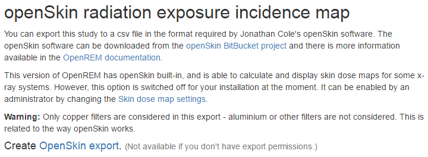

#############################
Exporting studies to OpenSkin
#############################

***********************
Functionality available
***********************

This is a temporary solution for 0.6.0; future versions will have OpenSkin integrated into the web interface.

* Fluoroscopy study export in a format suitable for OpenSkin
* Currently OpenSkin must be downloaded and run independently

************************
Instructions for OpenREM
************************

Select the fluoroscopy study you wish to create the exposure incidence map for and go to the detail view. Then click on
link to create the OpenSkin export:

*************************
Instructions for OpenSkin
*************************

Download the latest version as a zip file from https://bitbucket.org/openskin/openskin/downloads. At the time of release
for OpenREM 0.6.0, the current OpenSkin release was 0.4, 26th March 2015. The application referred to here will only
work on Windows. When OpenSkin is built into OpenREM, it will work on both Linux and Windows servers.

* Extract the contents of the zip file into a folder on your computer and run the openSkin.exe executable
* Choose a phantom type: 3D or flat. See `Phantom design`_ for details, but in summary:

    * Flat represents the exposure incidence if the X-rays had been delivered to a film placed flat on the couch
    * 3D represents the exposure incidence if the X-rays had been delivered to a phantom consisting of a cuboid with
      one semi-cylinder on each side

* Select the source csv file - this should be the one exported from OpenREM
* Select the output folder - this should already exist as it can't be created in the dialogue
* Wait! Depending on the number of events in the export and the power of your machine, this can take a few minutes

Two files will be produced - a textfile called ``skin_dose_results.txt`` and a small image called ``skin_dose_map.png``

Results text file
=================

It should look something like this::

    File created    : 04/21/15 17:42:45
    Data file       : C:/Users/[...]/exports-2015-04-21-OpenSkinExport20150421-162805246134.csv
    Phantom         : 90.0x70.0 3d phantom
    Peak dose (Gy)  :                  0.50844405521
    Cells > 3 Gy    :                              0
    Cells > 5 Gy    :                              0
    Cells > 10 Gy   :                              0

The peak dose is the peak incident dose delivered to any one-cm-square area. If any of these 1 cm\ :sup:`2` areas
(referred to as cells) are above 3 Gy, then the number of cells in this category, or the two higher dose categories,
are listed in the table accordingly.

Incidence map image file
========================

The image file will be a small 70x90 px PNG image if you used the 3D phantom, or 150 x 50 px PNG if you used the 2D phantom.
With both, the head end of the table is on the left.

The image is scaled so that black is 0 Gy and white is 10 Gy. For most studies, this results in an incidence map that is
largely black! However, if you use `GIMP`_ or `ImageJ`_ or similar to increase the contrast, you will find that the
required map is there.

A native and 'colour equalised' version of the same export are shown below:

.. raw:: html

   

.. raw:: html

    

***********
Limitations
***********

OpenSkin is yet to be validated independently - if this is something you want to do, please do go ahead and feed back your findings to Jonathan Cole at https://bitbucket.org/jacole/

.. _`Phantom design`: https://bitbucket.org/jacole/openskin/wiki/Phantom%20design
.. _`GIMP`: http://www.gimp.org/
.. _ImageJ: http://imagej.nih.gov/ij/download.html