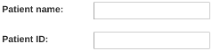

#########################
Patient identifiable data
#########################

Prior to version 0.7, no data that is generally considered to be patient identifiable was stored in the OpenREM database.

The following patient descriptors have always been recorded if they were available:

* Patient age at the time of the study, but not date of birth (though this could be calculated from age)
* Patient sex
* Patient height
* Patient weight

In addition, a key identifier for the exam that is normally not considered patient identifiable was stored:

* Study accession number

It has become apparent that there are reasons where people need to store patient identifiable data to make the most of
OpenREM, so this is now configurable from version 0.7 onwards.

************************
Configure what is stored
************************

.. figure:: img/ConfigMenu.png
    :figwidth: 30 %
    :align: right
    :alt: Configuration menu

On the Config menu, select ``Patient ID``:

.. raw:: html

    

The initial settings are as follows:

The default for patient name, ID and date of birth is to not store them. There isn't an option currently to not store
the accession number, though OpenREM continues to work if it is missing.

To store patient identifiable data from now on, select the relevant box and press ``Submit``. If you change the
setting again later, then data already stored will remain in the database.

*************************
Store encrypted data only
*************************

If you wish to have the patient name and/or ID available for finding studies relating to a specific patient, but do
not need to identify who that patient is, then it is possible to create an 'encrypted' version of the ID or name. In this
case, a one-way SHA 256 hash is generated and the hash value is stored instead.

If *exactly* the same name or ID (including spelling, spacing, case etc) occurs more than once, then the same hash
will be generated.

The same applies to accession numbers if the option to encrypt the accession number is selected.

*******************************
Using patient identifiable data
*******************************

Querying for patient studies
============================

In the modality pages of the OpenREM web interface, if you are in the ``pidgroup`` you will have a filter for patient
name and patient ID available:

If the values in the database are *not* encrypted, then partial search terms can be used as a case-insensitive
'contains' query will be applied.

If the values are encrypted, then only the entire string, with exactly the same case, spacing and punctuation will
match. This is more likely to be successful with patient ID than with patient name.

Study export with patient identifiers
=====================================

Users in the ``pidgroup`` will have extra export buttons available in the modality pages:

If the IDs or names are encrypted, then these columns will contain the hash rather than the original values. However, it
will be possible to see if more than one study belongs to one patient as the values should be the same for both. Due to
the nature of the algorithm however, a single change in the name or ID - such as an upper case letter instead of a lower
case one - will be recorded as a completely different hash value.

Any exports with either patient name or patient ID included will also have a date of birth column.