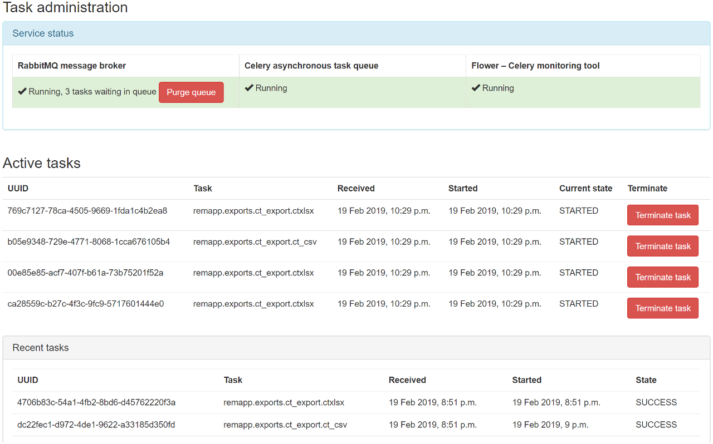
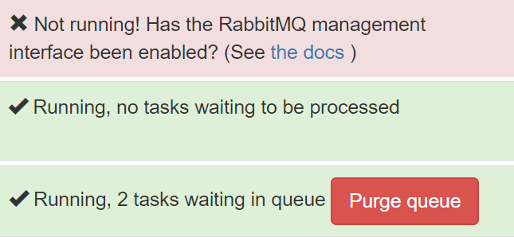
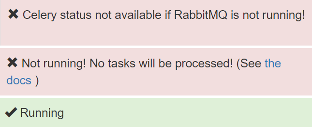
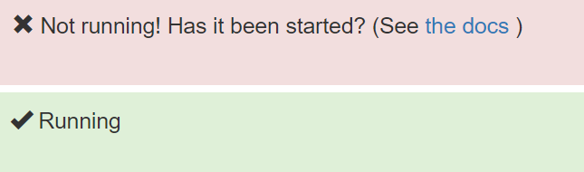

Task management
***************
*New in 0.9*

.. contents::

Enabling RabbitMQ management
============================

Installation instructions were added in 0.9.0. Users upgrading from previous versions should review
:ref:`enableRabbitMQ`.

Viewing task and service statuses
=================================

.. figure:: img/ConfigMenu.png
   :figwidth: 30%
   :align: right
   :alt: Config options

   Figure 1: The ``Config`` menu (user and admin)

Users who are logged in with admin rights can use the **Config** menu and choose **Tasks** to see the following:

* The status of the task message broker, RabbitMQ
* The status of the asynchronous task queue, Celery
* The status of the Celery monitoring tool, Flower
* How many tasks are waiting in RabbitMQ for a Celery worker to be available
* A list of the tasks currently being managed by Celery
* A list of previous tasks and their final status

   Figure 2: The task administration page

Service statuses
================
The current status of the services necessary to execute and monitor tasks is displayed in the first section of the page.

RabbitMQ message broker
-----------------------

   Figure 3: RabbitMQ statuses: failed; running, no tasks waiting; running, two tasks waiting

When tasks are created, they are sent to Celery to be processed via a message broker, RabbitMQ. Therefore this service
must be running for any of the asynchronous tasks to execute - for example query-retrieve operations and exports.
Normal function is indicated with a green status and a tick.

When there are Celery workers available to take tasks, they will be passed through immediately and the service status
be green as seen in the middle image of Figure 3. When all the Celery workers are busy any additional tasks will be held
with the RabbitMQ broker, and an option to purge the queue is made available as in the bottom image in Figure 3.

Celery asynchronous task queue
------------------------------

   Figure 4: Celery statuses: no RabbitMQ; not running; running

Celery is used to manage the tasks that need to be carried out asynchronously. In OpenREM, these tend to be long running
tasks such as exports and query-retrieve.

If RabbitMQ is not running, we can't tell if Celery is running; this is indicated by the first panel in Figure 4. If
RabbitMQ is running but Celery isn't, this is indicated by the middle panel in Figure 4.

Finally, when Celery is running a green panel with a tick is presented.

Flower - Celery monitoring tool
-------------------------------

   Figure 5: Flower statuses: not running; running

Flower enables monitoring of the Celery queues so we can see what is currently running, terminate if necessary, and
maintain a log of previous tasks and how they finished. Flower logs are reset on restart of the service.

If Flower is not running, the Flower status panel will look like the top half of Figure 5. If it is running, the panel
will look like the bottom half of Figure 5.

Terminating running tasks
=========================

Active tasks are listed after the service status section, as seen in Figure 2. The number of active tasks is limited by
the number of workers you have configured - see :ref:`celery_concurrency` for details.

It is possible to terminate any running tasks by clicking the red button. There is no confirmation step.

