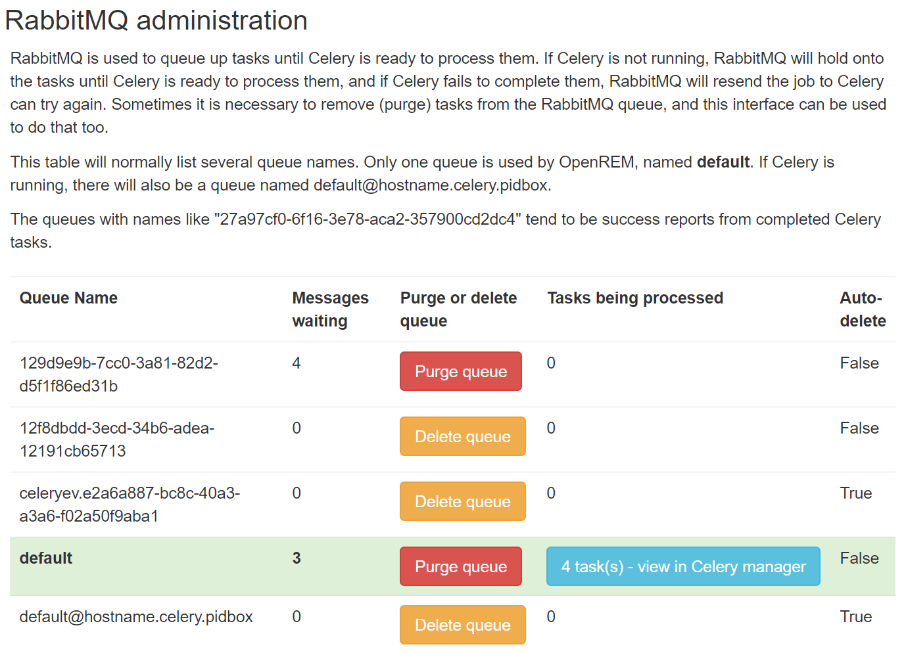
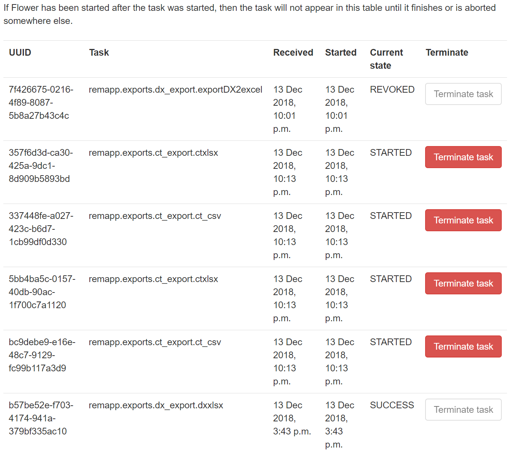

Task management
***************
*New in 0.9*

.. contents::

Enabling RabbitMQ management
============================

Installation instructions were added in 0.9.0. Users upgrading from previous versions should review
:ref:`enableRabbitMQ`.

Viewing task and service statuses
=================================

.. figure:: img/ConfigMenu.png
   :figwidth: 30%
   :align: right
   :alt: Config options

   Figure 1: The ``Config`` menu (user and admin)

Users who are logged in with admin rights can use the **Config** menu and choose **Tasks** to see the following:

* The status of the task message broker, RabbitMQ
* The status of the asynchronous task queue, Celery
* The status of the Celery monitoring tool, Flower
* How many tasks are waiting in RabbitMQ for a Celery worker to be available
* A list of the tasks currently being managed by Celery
* A list of previous tasks and their final status

.. figure:: img/tasks3waiting4inprogress.png
   :figwidth: 100%
   :align: center
   :alt: Task and service status

   Figure 2: The task administration page

Service statuses
================
The current status of the services necessary to execute and monitor tasks is displayed in the first section of the page.

RabbitMQ message broker
-----------------------

.. figure:: img/tasksrabbitstatuses.png
   :figwidth: 50%
   :align: right
   :alt: RabbitMQ status

   Figure 3: RabbitMQ statuses: failed; running, no tasks waiting; running, two tasks waiting

When tasks are created, they are sent to Celery to be processed via a message broker, RabbitMQ. Therefore this service
must be running for any of the asynchronous tasks to execute - for example query-retrieve operations and exports.
Normal function is indicated with a green status and a tick.

When there are Celery workers available to take tasks, they will be passed through immediately and the service status
be green as seen in the middle image of Figure 3. When all the Celery workers are busy any additional tasks will be held
with the RabbitMQ broker, and an option to purge the queue is made available as in the bottom image in Figure 3.

Celery asynchronous task queue
------------------------------

.. figure:: img/taskscelerystatuses.png
   :figwidth: 50%
   :align: right
   :alt: Celery status

   Figure 4: Celery statuses: no RabbitMQ; not running; running

If RabbitMQ is not running, we can't tell if Celery is running; this is indicated by the first panel in Figure 4. If
RabbitMQ is running but Celery isn't, this is indicated by the middle panel in Figure 4. Finally, when Celery is running
a green panel with a tick is presented.

Flower - Celery monitoring tool
-------------------------------

Viewing and managing RabbitMQ queues
====================================

.. figure:: img/ConfigMenu.png
   :figwidth: 30%
   :align: right
   :alt: Config options

   Figure 1: The ``Config`` menu (user and admin)

RabbitMQ queues can now be viewed within the OpenREM web interface if you are logged in as an admin user. If required,
queues can also be purged and deleted using this interface.

The queue used by OpenREM is named **default**, and is highlighted in green.

**Messages waiting** indicates the number of tasks in the queue that are yet to be actioned.
This will be because either Celery isn't running, or because all it's workers are busy.

**Tasks being processed** indicates how many tasks Celery is currently processing.

When tasks are complete, messages are sent to queues that have names such as ``27a97cf0-6f16-3e78-aca2-357900cd2dc4``.

Tasks are persistent, so RabbitMQ will attempt to get them processed even if you stop the service or reboot the
machine. Sometimes this is not desirable, and it can be necessary to delete the tasks from the queue. To do this, click
on the Purge button for that queue (see figure 2).

Once a queue has no messages waiting and no tasks being processed, you can delete the queue if you wish - this shouldn't
normally be necessary.

In the example below, four tasks are currently being processed by Celery and three are waiting to be processed. One
queue has acknowlegements in and can be purged, another is empty and can be deleted if you wish. The tasks that are
waiting to be processed can be purged too before they get to Celery. The ones that are already being processed can be
managed by following the link to the Celery manager.

   Figure 2: The RabbitMQ management table

Viewing and managing Celery tasks
=================================

Celery queues can also be viewed if you are logged in as an admin user.

If necessary, tasks can be terminated by clicking on the button. Below you can see four tasks in progress, one that has
finished successfully and one that has been revoked (stopped and deleted).

   Figure 3: The Celery management table