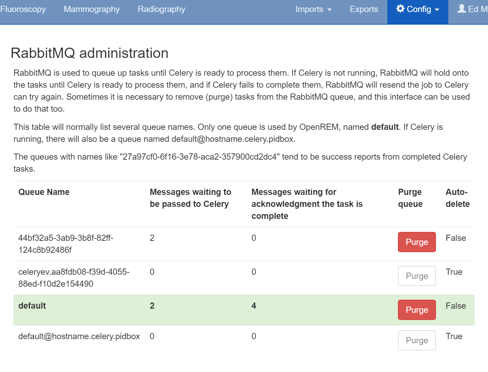

RabbitMQ management
*******************
*New in 0.8.2*

.. contents::

Viewing and purging RabbitMQ queues
===================================

.. figure:: img/ConfigMenu.png
   :figwidth: 30%
   :align: right
   :alt: Config options

   Figure 1: The ``Config`` menu (user and admin)

RabbitMQ queues can now be viewed within the OpenREM web interface if you are logged in as an admin user. If required,
queues can also be purged using this interface.

The queue used by OpenREM is named **default**, and is highlighted in green.

**Messages waiting to be passed to Celery** indicates the number of tasks in the queue that are yet to be actioned.
This will be because either Celery isn't running, or because all it's workers are busy.

**Messages waiting for acknowledgment the task is complete** indicates how many tasks Celery is currently processing.

When tasks are complete, messages are sent to queues that have names such as ``27a97cf0-6f16-3e78-aca2-357900cd2dc4``.

The tasks are persistent, so RabbitMQ will attempt to get them processed even if you stop the service or reboot the
machine. Sometimes this is not desirable, and it can be necessary to delete the tasks from the queue. To do this, click
on the Purge button for that queue (see figure 2).

In the example below, four tasks are currently being processed by Celery, two are waiting to be processed, and two have
finished.

   Figure 2: The RabbitMQ management table
