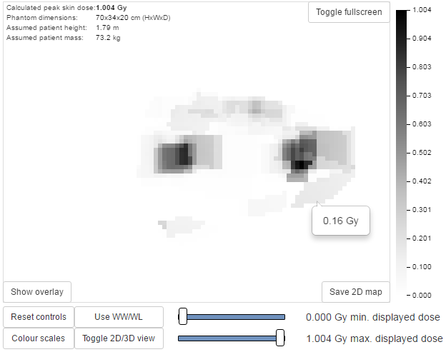
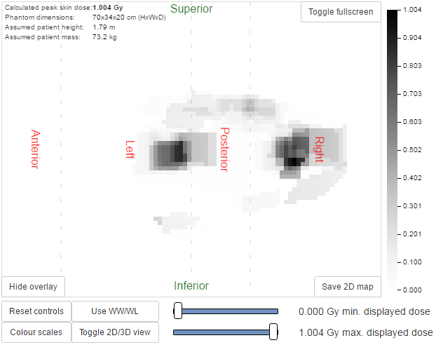
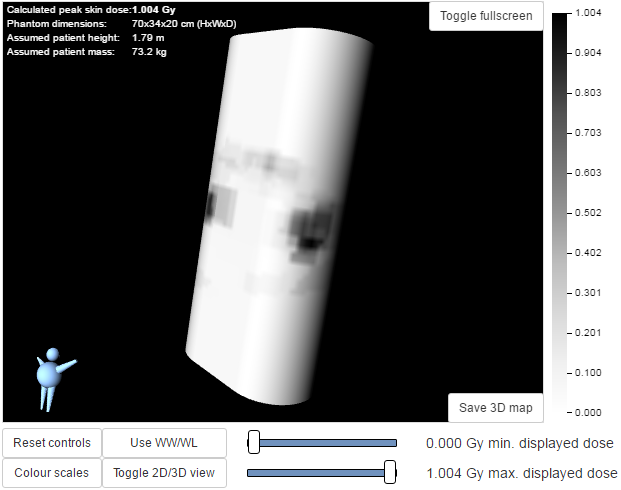
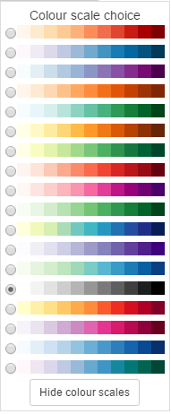

#########################################
Calculation and display of skin dose maps
#########################################

**Documentation needs to be updated for 0.8.0 release**

************************************
Functionality that will be available
************************************

* Skin dose map data calculated to the surface of a simple geometric phantom
  using the in-built `openSkin`_ routines (3D phantom)
* Phantom dimensions calculated from the height and mass of the patient
* Data can be calculated on import to OpenREM, or on demand when a study is
  viewed
* Data is recalculated automatically if the patient height or mass stored in
  the database differs from the values stored in the skin dose map data file.
  This is useful when patient size information has imported in to OpenREM after
  the initial skin dose map data has been calculated
* 3D skin dose map data shown graphically as a 2D image and a 3D model
* The user can change the maximum and minimum displayed dose; alternatively,
  window level and width can be adjusted
* A colour dose scale is shown with a selection of colour schemes
* The skin dose map section can be displayed full-screen
* The calculated peak skin dose, phantom dimensions and patient height and mass
  used for the calculations are shown in the top left hand corner of the skin
  dose map
* If skin dose map display is disabled then fluoroscopy study data can be
  exported in a format suitable for the stand-alone openSkin routines

The phantom consists of a cuboid with one semi-cylinder on each side (see
3D phantom section of `phantom design`_ on the openSkin website for details). A
default height of 1.786 m and mass of 73.2 kg are used if patient-specific data
are unavailable.

2D visualisation of the 3D data
===============================

This is a 2D view of the whole surface of the 3D phantom, as though the phantom
surface has been peeled off and laid out flat. The 2D visualisation includes
the following features:

* The skin dose at the mouse pointer is shown as a tool-tip
* Moving the mouse whilst holding down the left-hand mouse button changes the
  window level and width of the displayed skin dose map
* An overlay indicating the phantom regions and orientation can be toggled on
  and off. This indicates the phantom anterior, left, posterior and right
  sides, and also shows the superior and inferior ends
* The current view can be saved as a png file

   
   Figure 1: 2D visualisation of the 3D data

   Figure 2: Phantom region overlay

3D visualisation
================

This is a 3D view of the phantom that was used for the calculations, with the
skin dose map overlaid onto the surface. The 3D visualisation includes the
following features:

* Moving the mouse whilst holding down the left-hand mouse button rotates the
  3D model
* Using the mouse wheel zooms in and out
* A simple 3D model of a person is displayed in the bottom left corner. This is
  to enable the viewer to orientate themselves when viewing the 3D skin dose
  map
* The current view can be saved as a png file

   Figure 3: 3D visualisation of the data

   Figure 4: Colour scale choices

**********************
Skin dose map settings
**********************

There are two skin dose map options that can be set by an OpenREM
administrator via the ``Skin dose map settings`` option in the ``Config menu``:

* Enable skin dose maps
* Calculate skin dose maps on import

The first of these sets whether skin dose map data is calculated, and also
switches the display of skin dose maps on or off. The second option controls
whether the skin dose map data is calculated at the point when a new study is
imported into OpenREM.

When skin dose maps are enabled:

* When a user views the details of a fluoroscopy study OpenREM looks for a skin
  dose map pickle file on the OpenREM server in the ``skin_maps`` subfolder of
  ``MEDIA_ROOT`` that corresponds to the study being viewed. If found, the skin
  dose map data in the pickle file is loaded and displayed. The ``skin_maps``
  folder is created if it does not exist
* If a pickle file is not found then OpenREM calculates skin dose map data.
  These calculations can take some time. They are carried out in the
  background: an animated graphic is shown during the calculations. On
  successful calculation of the data the skin dose map is displayed. A pickle
  file containing the data is saved in the server's ``skin_maps`` subfolder of
  ``MEDIA_ROOT``. The file name is of the form ``skin_map_XXXX.p``, where
  ``XXXX`` is the database primary key of the study
* For subsequent views of the same study the data in the pickle file is loaded,
  rather than re-calculating the data, making the display of the skin dose map
  much quicker

When calculation on import is enabled:

* OpenREM calculates the skin dose map data for a fluoroscopy study as soon as
  it arrives in the system
* A pickle file containing the data is saved in the ``skin_maps`` subfolder of
  ``MEDIA_ROOT``
* Users viewing the details of a study won't have to wait for the skin dose map
  data to be calculated

**************************
Exporting data to openSkin
**************************

If skin dose maps are disabled the user you are presented with the option of exporting
the study data as a csv file for use with a stand-alone installation of
openSkin. Select the fluoroscopy study you wish to create the exposure
incidence map for and go to the detail view. Then click on the link to create
the OpenSkin export (figure 5).

.. figure:: img/OpenSkinExport.png
   :figwidth: 50%
   :align: right
   :alt: Export from OpenREM to openSkin
   :target: _images/OpenSkinExport.png

   Figure 5: Export from OpenREM to openSkin

*************************
Instructions for openSkin
*************************

Download the latest version as a zip file from `openSkin downloads`_. At the
time of release for OpenREM 0.7.0 the current openSkin beta was dated 14th
September 2016. The application referred to here will only work on Windows.

* Extract the contents of the zip file into a folder on your computer and run
  the openSkin.exe executable
* Choose a phantom type: 3D or flat. See `phantom design`_ for details
* Select the source csv file - this should be the one exported from OpenREM
* Select the output folder - this should already exist as it can't be created
  in the dialogue
* Wait! Depending on the number of events in the export and the power of your
  machine, this can take a few minutes

Two files will be produced - a textfile called ``skin_dose_results.txt`` and a
small image called ``skin_dose_map.png``

Results text file
=================

It should look something like this::

    File created    : 04/21/15 17:42:45
    Data file       : C:/Users/[...]/exports-2015-04-21-OpenSkinExport20150421-162805246134.csv
    Phantom         : 90.0x70.0 3d phantom
    Peak dose (Gy)  :                  0.50844405521
    Cells > 3 Gy    :                              0
    Cells > 5 Gy    :                              0
    Cells > 10 Gy   :                              0

The peak dose is the peak incident dose delivered to any one-cm-square area. If
any of these 1 cm\ :sup:`2` areas (referred to as cells) are above 3 Gy, then
the number of cells in this category, or the two higher dose categories, are
listed in the table accordingly.

Incidence map image file
========================

The image file will be a small 70x90 px PNG image if you used the 3D phantom,
or 150 x 50 px PNG if you used the 2D phantom. With both, the head end of the
table is on the left.

The image is scaled so that black is 0 Gy and white is 10 Gy. For most studies,
this results in an incidence map that is largely black. However, if you use
`GIMP`_ or `ImageJ`_ or similar to increase the contrast, you will find that
the required map is there.

A native and 'colour equalised' version of the same export are shown below:

.. raw:: html

   

.. image:: img/skin_dose_map.png
    :width: 210px
    :align: left
    :alt: OpenSkin incidence map, unscaled
    :target: _images/skin_dose_map.png

.. image:: img/skin_dose_map_scaled.png
    :width: 210px
    :align: right
    :alt: OpenSkin incidence map, scaled
    :target: _images/skin_dose_map_scaled.png

.. raw:: html

    

***********
Limitations
***********

Skin dose map calculations do not currently work for all systems. Siemens Artis
Zee data is known to work. If skin dose maps do not work for your systems then
please let us know via the `OpenREM Google Group`_.

`openSkin`_ is yet to be validated independently - if this is something you
want to do, please do go ahead and feed back your findings to Jonathan Cole at
`jacole`_.

.. _`phantom design`: http://bitbucket.org/openskin/openskin/wiki/Phantom%20design
.. _`openSkin`: http://bitbucket.org/openskin/openskin
.. _`jacole`: http://bitbucket.org/jacole/
.. _`OpenREM Google Group`: http://groups.google.com/forum/#!forum/openrem
.. _`GIMP`: http://www.gimp.org/
.. _ImageJ: http://imagej.nih.gov/ij/download.html
.. _`openSkin downloads`: http://bitbucket.org/openskin/openskin/downloads