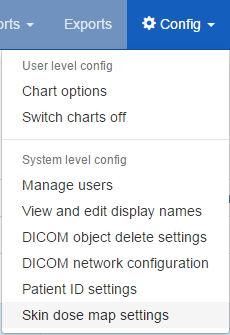
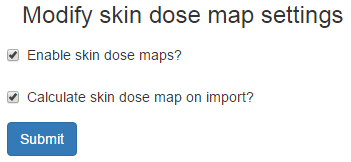

########################################
Calulation and display of skin dose maps
########################################

***********************
Functionality available
***********************

* Skin dose map data calculated to the surface of a simple geometric phantom
  using the in-built `openSkin`_ routines (3D phantom)
* Phantom dimensions calculated from the height and mass of the patient
* Data can be calculated on import to OpenREM, or on demand when a study is
  viewed
* 3D skin dose map data shown graphically as a 2D image and a 3D model
* The user can change the maximum and minimum displayed dose; alternatively,
  window level and width can be adjusted
* A colour dose scale is shown with a selection of colour schemes
* The skin dose map section can be displayed full-screen
* The calculated peak skin dose, phantom dimensions and patient height and mass
  used for the calculations are shown in the top left hand corner of the skin
  dose map.

The phantom consists of a cuboid with one semi-cylinder on each side (see
3D phantom section of `phantom design`_ on the openSkin website for details). A
default height of 1.786 m and mass of 73.2 kg are used if patient-specific data
are unavailable.

===============================
2D visualisation of the 3D data
===============================

.. figure:: img/skinDoseMap2D.png
   :figwidth: 50%
   :align: right
   :alt: 2D visualisation of the 3D skin dose map data

   Figure 1: 2D visualisation of the 3D data

This is a 2D view of the whole surface of the 3D phantom, as though the phantom
surface has been peeled off and laid out flat.

.. figure:: img/skinDoseMap2DincOverlay.png
   :figwidth: 50%
   :align: right
   :alt: 2D visualisation of the 3D skin dose map including phantom region overlay

   Figure 2: Phantom region overlay

The 2D visualisation includes the following features:

* The skin dose at the mouse pointer is shown as a tooltip
* Moving the mouse whilst holding down the left-hand mouse button changes the
  window level and width of the displayed skin dose map
* An overlay indicating the phantom regions and orientation can be toggled on
  and off. This indicates the phantom anterior, left, posterior and right
  sides, and also shows the superior and inferior ends
* The current view can be saved as a png file

.. figure:: img/skinDoseMapColourScales.png
   :figwidth: 50%
   :align: right
   :alt: Colour scale choices

   Figure 3: Colour scale choices

================
3D visualisation
================

.. figure:: img/skinDoseMap3D.png
   :figwidth: 50%
   :align: right
   :alt: 3D visualisation of the skin dose map data

   Figure 4: 3D visualisation of the data

This is a 3D view of the phantom that was used for the calculations, with the
skin dose map overlaid onto the surface.

The 3D visualisation includes the following features:

* Moving the mouse whilst holding down the left-hand mouse button rotates the
  3D model
* Using the mouse wheel zooms in and out
* A simple 3D model of a person is displayed in the bottom left corner. This is
  to enable the viewer to orientate themselves when viewing the 3D skin dose
  map
* The current can be saved as a png file

**********************
Skin dose map settings
**********************

   Figure 5: Skin dose map settings menu item

   Figure 6: Skin dose map settings

There are two skin dose map options that can be set by an OpenREM
administrator:

* Enable skin dose maps
* Calculate skin dose maps on import

The first of these sets whether skin dose map data is calculated, and also
switches the display of skin dose maps on or off. The second option controls
whether the skin dose map data is calculated at the point when a new study is
imported into OpenREM.

When skin dose maps are enabled:

* OpenREM attempts to calculate skin dose map data when a user views the
  details of a fluoroscopy study. These calculations can take some time
* The calculations are carried out in the background: an animated graphic is
  shown whilst the calculations are carried out
* On successful calculation of the data the skin dose map is displayed
* The calculated skin dose map data is saved as a pickle file on the OpenREM
  server in a **skin_maps** subfolder of **MEDIA_ROOT**
* For subsequent views of the same study the data in the pickle file is loaded,
  rather than re-calculating the data, making the display of the skin dose map
  much quicker

When calculation on import is enabled:

* OpenREM calculates the skin dose map data as soon as it arrives in the system
* A pickle file containing the data is saved
* Users viewing the details of a study won't have to wait for the skin dose map
  data to be calculated

***********
Limitations
***********

Skin dose map calculations do not currently work for all systems. Siemens Artis
Zee data is known to work. If skin dose maps do not work for your systems then
please let us know via the `OpenREM Google Group`_.

`openSkin`_ is yet to be validated independently - if this is something you
want to do, please do go ahead and feed back your findings to Jonathan Cole at
`jacole`_.

.. _`phantom design`: http://bitbucket.org/openskin/openskin/wiki/Phantom%20design
.. _`openSkin`: http://bitbucket.org/openskin/openskin
.. _`jacole`: http://bitbucket.org/jacole/
.. _`OpenREM Google Group`: http://groups.google.com/forum/#!forum/openrem