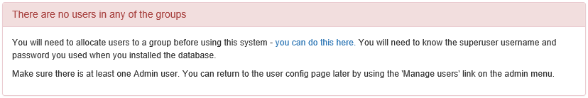
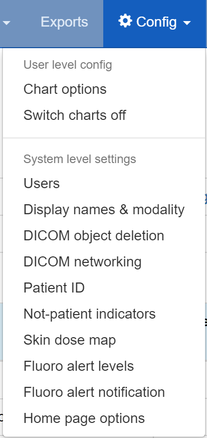
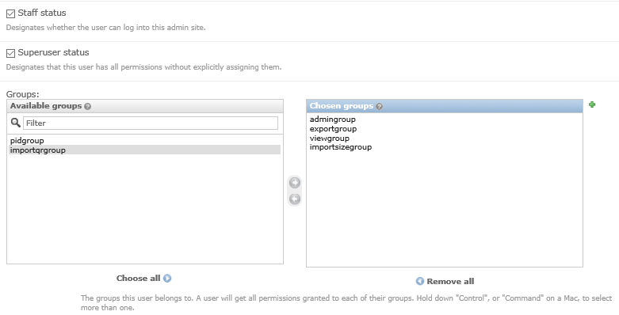

**********************
Start all the services
**********************

Test web server
===============

In a shell/command window, move into the openrem folder:

* Ubuntu linux: ``/usr/local/lib/python2.7/dist-packages/openrem/``
* Other linux: ``/usr/lib/python2.7/site-packages/openrem/``
* Linux virtualenv: ``lib/python2.7/site-packages/openrem/`` (remember to activate the virtualenv)
* Windows: ``C:\Python27\Lib\site-packages\openrem\``
* Windows virtualenv: ``Lib\site-packages\openrem\`` (remember to activate the virtualenv)

Web access on OpenREM server only
^^^^^^^^^^^^^^^^^^^^^^^^^^^^^^^^^

Run the built in web server:

.. sourcecode:: console

    python manage.py runserver --insecure

In a web browser on the same computer, go to http://localhost:8000/ - you should now see the message about creating
users. For full functionality start the `Celery task queue`_ before moving on to `Configure the settings`_.

Web access on other computers
^^^^^^^^^^^^^^^^^^^^^^^^^^^^^

The built-in webserver only provides a service on the computer OpenREM is installed on by default (it's only there
really for testing). To view the OpenREM interface on another computer, you need to modify the ``runserver`` command:

.. sourcecode:: console

    python manage.py runserver --insecure 0.0.0.0:8000

This will enable the web service to be available from other computers on the network. If your server has several
network cards and you want to restrict it to one, then you can use a real address rather than ``0.0.0.0``. Likewise you can
specify the port (here it is ``8000``).

In a web browser on a different computer on the same network, go to http://192.168.1.10:8000/ (**changing the IP address**
to the one you are running the server on) and you should see the OpenREM interface and the message about creating users.
For full functionality start the `Celery task queue`_ before moving on to `Configure the settings`_.

..  Note::

    Why are we using the ``--insecure`` option? With ``DEBUG`` mode set to ``True``
    the test web server would serve up the static files. In this release,
    ``DEBUG`` mode is set to ``False``, which prevents the test web server
    serving those files. The ``--insecure`` option allows them to be served again.

Celery task queue
=================

Celery will have been automatically installed with OpenREM, and along with
RabbitMQ allows for asynchronous task processing for imports, exports and DICOM networking tasks.

..  Note::

    Celery needs to be able to write to the place where the Celery logs and pid file are to be stored, so make sure:

    * the folder exists (the suggestion below is to create a folder in the ``MEDIA_ROOT`` location)
    * the user that starts Celery can write to that folder

You can put the folder wherever you like, for example you might like to create a ``/var/log/openrem/`` folder on a linux
system.

If you are using the built-in `Test web server`_ then Celery and the webserver will be running as your user. If you are
running a production webserver, such as Apache or nginx on linux, then the user that runs those daemons will need to
be able to write to the ``MEDIA_ROOT`` and the Celery log files folder. In this case, you need to change the ownership
of the folders and change to the right user before running Celery. On Ubuntu:

.. sourcecode:: console

    mkdir /path/to/media/celery  # change as appropriate
    sudo chown www-data /path/to/media  # change as appropriate
    sudo su -p www-data

Now start celery...

Move into the openrem folder:

* Ubuntu linux: ``/usr/local/lib/python2.7/dist-packages/openrem/``
* Other linux: ``/usr/lib/python2.7/site-packages/openrem/``
* Linux virtualenv: ``lib/python2.7/site-packages/openrem/`` (remember to activate the virtualenv)
* Windows: ``C:\Python27\Lib\site-packages\openrem\``
* Windows virtualenv: ``Lib\site-packages\openrem\`` (remember to activate the virtualenv)

Linux - ``\`` is the line continuation character:

.. sourcecode:: console

    celery multi start default -A openremproject -c 4 -Q default \
    --pidfile=/path/to/media/celery/%N.pid --logfile=/path/to/media/celery/%N.log

Windows - ``celery multi`` doesn't work on Windows, and ``^`` is the continuation character:

.. sourcecode:: console

    celery worker -n default -A openremproject -c 4 -Q default ^
    --pidfile=C:\path\to\media\celery\default.pid --logfile=C:\path\to\media\celery\default.log

For production use, see `Daemonising Celery`_ below

Set the number of workers (concurrency, ``-c``) as you see fit. The more you have, the more processes (imports, exports,
query-retrieve operations etc) can take place simultaneously. However, each extra worker uses extra memory and if you
have too many they will be competing for CPU resources too.

To stop the celery queues in Linux:

.. sourcecode:: console

    celery multi stop default --pidfile=/path/to/media/celery/%N.pid

For Windows, just press ``Ctrl+c``

You will need to do this twice if there are running tasks you wish to kill.

.. _celery-beat:

Celery periodic tasks: beat
===========================

.. note::

    Celery beat is only required if you are using the :ref:`nativestore`. Please read the warnings there before deciding
    if you need to run Celery beat. At the current time, using a third party DICOM store service is recommended for
    most users. See the :doc:`netdicom` documentation for more details

Celery beat is a scheduler. If it is running, then every 60 seconds a task is run to check if any of the DICOM
Store SCP nodes are set to ``keep_alive``, and if they are, it tries to verify they are running with a DICOM echo.
If this is not successful, then the Store SCP is started.

To run celery beat, open a new shell and move into the openrem folder:

* Ubuntu linux: ``/usr/local/lib/python2.7/dist-packages/openrem/``
* Other linux: ``/usr/lib/python2.7/site-packages/openrem/``
* Linux virtualenv: ``lib/python2.7/site-packages/openrem/`` (remember to activate the virtualenv)
* Windows: ``C:\Python27\Lib\site-packages\openrem\``
* Windows virtualenv: ``Lib\site-packages\openrem\`` (remember to activate the virtualenv)

Linux::

    celery -A openremproject beat -s /path/to/media/celery/celerybeat-schedule \
    -f /path/to/media/celery/celerybeat.log \
    --pidfile=/path/to/media/celery/celerybeat.pid

Windows::

    celery -A openremproject beat -s C:\path\to\media\celery\celerybeat-schedule ^
    -f C:\path\to\media\celery\celerybeat.log ^
    --pidfile=C:\path\to\media\celery\celerybeat.pid

For production use, see `Daemonising Celery`_ below

As with starting the Celery workers, the folder that the pid, log and for beat, schedule files are to be written
**must already exist** and the user starting Celery beat must be able write to that folder.

To stop Celery beat, just press ``Ctrl+c``

.. _user-settings:

Configure the settings
======================

* Follow the link presented on the front page to get to the user and group administration.

* After the first users are configured, this link will no longer be presented and instead you can go to
  ``Config -> Users``.
* You will need the superuser username and password you created just after creating the database. The groups are

    + ``viewgroup`` can browse the data only
    + ``importsizegroup`` can use the csv import facility to add patient height and weight information
    + ``importqrgroup`` can use the DICOM query-retrieve facility to pull in studies, as long as they are pre-configured
    + ``exportgroup`` can view and export data to a spreadsheet
    + ``pidgroup`` can search using patient names and IDs depending on settings, and export with patient names and IDs
      if they are also a member of the ``exportgroup``
    + ``admingroup`` can delete studies, configure DICOM Store/QR settings, configure DICOM keep or delete settings,
      configure patient ID settings, and abort and delete patient size import jobs. *Members of the admingroup no longer
      inherit the other groups permissions.*

* In addition to adding users to these groups, you may like to grant a second user ``superuser`` and ``staff`` status
  so that there are at least two people who can manage the users
* Return to the OpenREM interface (click on ``View site`` at the top right)

* Follow the link to see more information about how you want OpenREM to identify non-patient exposures, such as QA.
  See :doc:`i_not_patient_indicator`.
* Go to ``Config -> DICOM object delete settings`` and configure appropriately (see :doc:`i_deletesettings`)
* Go to ``Config -> Patient ID settings`` and configure appropriately (see :doc:`patientid`)
* If you want to use OpenREM as a DICOM store, or to use OpenREM to query remote systems, go to
  ``Config -> Dicom network configuration``. For more information go to :doc:`netdicom` (not yet up to date)
* With data in the system, you will want to go to ``Config -> View and edit display names`` and customise
  the display names. An established system will have several entries for each device, from each time the software
  version, station name or other elements changes. See :doc:`i_displaynames` for more information

Start using it!
===============

Add some data!

.. sourcecode:: bash

    openrem_rdsr.py rdsrfile.dcm

Further instructions
====================

Daemonising Celery
^^^^^^^^^^^^^^^^^^

In a production environment, Celery will need to start automatically and
not depend on a particular user being logged in. Therefore, much like
the webserver, it will need to be daemonised. For now, please refer to the
instructions and links at http://celery.readthedocs.org/en/latest/tutorials/daemonizing.html.

